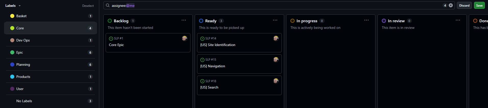

# Searchlight Promotions (Upgrade)

# Table of contents
- [Searchlight Promotions (Upgrade)](#searchlight-promotions--upgrade-)
- [Table of contents](#table-of-contents)
  * [1. Introduction](#1-introduction)
    + [1.1 The Aim, Purpose and Goal of the Site](#11-the-aim--purpose-and-goal-of-the-site)
    + [1.2 Target Audience](#12-target-audience)
  * [2. Planning and Development](#2-planning-and-development)
    + [2.1 Project Statement and ERD](#21-project-statement-and-erd)
    + [2.1.1 Identified Entities (Key Nouns):](#211-identified-entities--key-nouns--)
    + [2.1.2 Key Relationships:](#212-key-relationships-)
    + [2.1.3 ERD (Entity Relationship Diagram)](#213-erd--entity-relationship-diagram-)
    + [2.2 Wireframes](#22-wireframes)
    + [2.3 User Journeys](#23-user-journeys)
    + [2.4 Agile Methodology](#24-agile-methodology)
      - [2.4.1 Epics & their User Stories](#241-epics---their-user-stories)
      - [2.4.1.1 Core Epic](#2411-core-epic)
      - [2.4.1.2 Products Epic](#2412-products-epic)
    + [2.4.1.3 Basket Epic](#2413-basket-epic)
    + [2.4.1.4 User Epic](#2414-user-epic)
    + [2.4.1.5 Checkout & Payments Epic](#2415-checkout---payments-epic)
    + [2.4.1.6 DevOps Epic](#2416-devops-epic)
  * [3. Features](#3-features)
    + [3.1 Home Page](#31-home-page)
      - [3.1.1 Site Navigation](#311-site-navigation)
      - [3.1.1.1 Navbar](#3111-navbar)
      - [3.1.1.2 Hamburger](#3112-hamburger)
      - [3.1.1.1 User Greeting](#3111-user-greeting)
    + [3.2 About Page](#32-about-page)
    + [3.3 Events Page](#33-events-page)
      - [3.3.1 Events Dropdown](#331-events-dropdown)
    + [3.4 Merch](#34-merch)
      - [3.4.1 Merch List](#341-merch-list)
      - [3.4.2 Merch Detail](#342-merch-detail)
  * [4. Debugging, Testing, Deployment and Future Developments](#4-debugging--testing--deployment-and-future-developments)
    + [4.1 Debugging](#41-debugging)
    + [4.2 Testing](#42-testing)
    + [4.3 Deployment](#43-deployment)
      - [4.3.1 Create a GitHub Repository](#431-create-a-github-repository)
      - [4.3.2 Clone the Repository to VS Code](#432-clone-the-repository-to-vs-code)
      - [4.3.3 Create and Activate a Virtual Environment](#433-create-and-activate-a-virtual-environment)
      - [4.3.4 Install Project Dependencies](#434-install-project-dependencies)
      - [4.3.5 Prepare the Project for Heroku](#435-prepare-the-project-for-heroku)
      - [4.3.6 Set Up a Heroku Account and CLI](#436-set-up-a-heroku-account-and-cli)
      - [4.3.7 Create a Heroku App](#437-create-a-heroku-app)
      - [4.3.8 Push Your Project to Heroku](#438-push-your-project-to-heroku)
      - [4.3.9 Configure Environment Variables on Heroku](#439-configure-environment-variables-on-heroku)
      - [4.3.10 Final Project Setup on Heroku](#4310-final-project-setup-on-heroku)
      - [4.3.11 Open Your Live Site](#4311-open-your-live-site)
    + [4.4 Future Developments](#44-future-developments)
  * [5. Credits and Acknowledegements](#5-credits-and-acknowledegements)
    + [5.1 Credits](#51-credits)
    + [5.2 Acknowledgements](#52-acknowledgements)

---

## 1. Introduction
This project is the natural progression of my first project *'Searchlight Promotions'*. For my first project I asked a fellow metal head, who runs a music promotion company in and for the Norwich rock and metal scene, if I could design him a website for my project, as he did not have one. After completing and submitting the project he asked me to maintain it going forward as he absolutely loved it. This ultimately meant that I had retained my first customer, and for the conclusion of this course, it is timely that the website is upgraded as the business has developed, my skills have progressed and as a true work-experience piece of practical evidence.

Project 1 can be found here in this *Github* repository (as it was submitted for P1): https://github.com/AxdeKlerk/Searchlight-Promotions, and here as the current working website: www.searchlightpromotions.co.uk. 

What is evident here is that the website has already had various upgrades, notable the inclusion of the link to the *ROXOFF* page using the logo in the navbar, shown here in the mobile view:

### 1.1 The Aim, Purpose and Goal of the Site

The primary aim of the website has always been to *"create a presence beyond the scope of social media to attract rock and metal fans, as well as emerging [..] rock and metal [artists], to current events happening in Norwich"*(Project 1). 

The website’s purpose is to highlight upcoming events and increase ticket sales for each gig by reaching rock and metal fans who may not follow social media. Additionally, it should clearly communicate the company’s promotional services to attract unsigned rock and metal artists interested in partnering for promotion within Norwich.

The goal of the upgrade is to bring the project to the same level of development and success that Searchlight Promotions has achieved and advance it further by introducing a dedicated online store for merchandise and establishing a proprietary ticketing system for events, eliminating the need for an external booking and payment system via a 3rd party website.

### 1.2 Target Audience

The target audience is niche and focuses only on the rock and metal musicians and fans. It is specifically aimed at an aging demographic of rock and metal fans who don’t rely on social media for gig information in Norwich, the new rise in younger rock and metal fans who are looking to support up-and-coming artists locally, emerging (and unsigned) rock and metal artists looking for promotion in Norwich, other music promoters who may want to collaborate, as well as music journalists wanting to cover gigs.

[add merch and ticket sales]

## 2. Planning and Development

### 2.1 Project Statement and ERD

This project involves developing a web application focused on promoting and managing rock and metal music **events** held at a **single fixed venue**. The website allows **users** to either **log in** or browse as **guests**. Logged in users have the the ability to browse upcoming events, **search for merchandise and/or tickets**, add them to a **basket** and **purchase** event tickets and merch.

Each event offers **tickets for sale**, which users can select and add to their **basket** alongside any **merchandise**. The store offers official **products** such as shirts, hoodies, and accessories, which can be **filtered by product description**. Users can then proceed to **checkout**, where they provide payment securely via **Stripe**.

Users will also be able to view and **track the status of their orders**,  
receive **email confirmations** for purchases, and search for **artists and bands** to discover more music.
    

### 2.1.1 Identified Entities (Key Nouns):

-   **User** (covers both registered and guest users)
-   **Event**
-   **Ticket**
-   **Artist/Band**
-   **Product** (Merch)
-   **Order**
-   **OrderStatus**
-   **Payment**
-   **Venue** (fixed, but modelled for potential reuse)
    

### 2.1.2 Key Relationships:

-   A **User** can place multiple **Orders**
-   Each **Order** can include multiple **Products** and **Tickets** 
-   Each **Ticket** is linked to one **Event**  
-   An **Event** features one or more **Artists / Bands** and belongs to one **Venue**
-   A **Product** may be associated with a single **Order**
-   Each **Order** is linked to one **Payment** and one **OrderStatus**
-   All **Events** occur at the event **Venue**
    
This structured statement sets a clear foundation for building an ERD and a relational database that supports both **ticketing** and **e-commerce features** within a unified system. 

### 2.1.3 ERD (Entity Relationship Diagram)

### 2.2 Wireframes
After completing the first draft of the ERD I draw it out visually as a low fidelity-wireframe for desktops in *Balsamic*, as shown here:

 Once I was happy with what it looked like I converted it into a low-fidelity wireframe for mobiles, as shown here also in *Balsamic*:

Having completed the above I went on to create a high-fidelity wireframe in *Figma*, focusing only on the desk top as everything would be responsive and feature as the low-fidelity wireframe for mobiles depicts above. All 3 versions focus on the functionality of the navbar. Meaning that all 3 were drawn around the navbar and plotted out as progressions. 

The high-fidelity wireframe show below helps to fully visualise the various screens and how they would look as a finished project. I decided to use some of the styling from my P3 for the tilting merch to create a more visually appealing view of the merch. This came about after doing some research on other websites (mainly rock and metal bands that I know and two festival sites that I go to each year) as to how they displayed their merch on their dedicated pages. 

The findings were mixed, however, most of the websites seemed to display their merch as an after thought that didn't follow the styling of the rest of their websites. The three stand-out websites, that did follow their overall styling, were *[Blacklakes](https://www.blacklakes.com/merch)*, *[South of Salem](https://www.southofsalem.com/)* and *[Slipknot](https://slipknotmerch.com/)*.

Slipknot's merch page stood out amoungst the rest and the decidion was made that, this project's website would follow Slipknot's style of layout, but make it different to anything else that could be found, by including the tilt styling.

### 2.3 User Journeys

Having completed the wireframes, user journeys were plotted out as imagined the user would journey would be through the website. First, the  current user journey was plotted out, from the *[Searchlight Promotions](www.searchlightpromotions.co.uk)* website, as shown here:

What stood out were the 'dead ends' (depicted in red) that navigate the user away from the website with the user having to return to the website by clicking back on the website tab. This blocks the user from an easy transition back to the website and considered 'bad' UI/UX.

This was pointed out to the client as a pitfall to the UX and stated that by upgrading the site to manage its own ticket sales we would create a seamless experience for the user, that kept them on the website for further browsing in the hope that it would encourage further sales and interest.

Below is the new user journey as first imagined. The items in red are still 3rd party websites for payment and email confirmations for logging in, however, with the introduction of a 'thank you' page the user would be returned to the website for further browsing after payment. After the email confirmation, the user will be redirected back to the website automatically.

### 2.4 Agile Methodology

This project was developed using Agile methodologies to ensure a user-focused, iterative, and flexible development process. Key Agile principles were applied throughout.

Having plotted the new user journey and user stories, 'Epics' were extracted form the user journey into the categories that follow. Each 'Epic' represents an App in the *Django* project design. Under each 'Epic', user stories were created using the "As a **user** I want to **action** so that I can **benefit**" statement to ensure a user story driven development and that all development decisions were tied directly to user needs. From each user story actionable tasks were created representing the acceptance criteria for each user story. 

The project was created in *[Github](https://github.com/users/AxdeKlerk/projects/7)*.

#### 2.4.1 Epics & their User Stories

Each epic was added to the Project Board using labels as can be seen here:

From the collapsable Core Epic, for example, the below details a descrption of the covered features, with the first 3 user stories below, and the tasks listed below the user stories:

The below shows the Site Indentification User Story as well as its corresponding Tasks List, as an example:

The above is a representation of the Kaban board and all its components. As the project developed more user stories and tasks were created. Throughout the design of the website this project board was referenced to keep the scope of the project realistic and on track. For convenience the project board can be found here: 

Below details all the Epic headings with their coresponding user stories: 

#### 2.4.1.1 Core Epic

- Site Identification  

- Navigation  

- Search  

- Contact Form  

- Footer  

- Base Template  

#### 2.4.1.2 Products Epic  

- Event Listings  

- Event Detail Page  

- Merch Listings  

- Merch Detail Page  

- Ticket Availability Tracking  

- Roxoff Page & Event Tickets  

### 2.4.1.3 Basket Epic  

- Add to Basket  

- View Basket  

- Update Basket  

- Remove from Basket  

- Basket Totals  

### 2.4.1.4 User Epic  

- Sign Up  

- Log In  

- Password Reset  

- Log Out  

- Profile  

- Email Confirmations (Backlog – Not MVP)  

### 2.4.1.5 Checkout & Payments Epic  

- Checkout Page  

- Square Payments Integration  

- Order Confirmation Page  

- Order History in Profile  

### 2.4.1.6 DevOps Epic  

- Deployment  

- 400 Error Page  

- 500 Error Page  

----

## 3. Features

### 3.1 Home Page

#### 3.1.1 Site Navigation

#### 3.1.1.1 Navbar

#### 3.1.1.2 Hamburger

#### 3.1.1.1 User Greeting

### 3.2 About Page

### 3.3 Events Page

#### 3.3.1 Events Dropdown

### 3.4 Merch

#### 3.4.1 Merch List

#### 3.4.2 Merch Detail

## 4. Debugging, Testing, Deployment and Future Developments

### 4.1 Debugging

Please refer to the debugging documentation for detailed descritions of all bugs found, fixed and learned from. It can be found here: [DEBUGGING.md](DEBUGGING.md)

### 4.2 Testing

Please refer to the testing documentation for detailed descritions of the tests completed found here: [TESTING.md](TESTING.md)

### 4.3 Deployment

This section outlines the full process for deploying this project from *GitHub* to your local machine using *VS Code*, and then hosting it live on *Heroku*.

#### 4.3.1 Create a GitHub Repository

- Go to *GitHub* and click the "+" icon to create a new repository
- Name the repository and optionally add a description
- Choose "Public" or "Private"
- Do not initialize with a README, .gitignore, or license
- Click "Create repository"

#### 4.3.2 Clone the Repository to VS Code

- Open *VS Code* and its terminal
- Navigate to the folder where you want your project
- Copy the repository's URL from *GitHub* and use the "Clone Git Repository" option in *VS Code*
- Open the project folder in *VS Code*
- 
#### 4.3.3 Create and Activate a Virtual Environment

- In your terminal, create a virtual environment inside your project folder
- Activate the environment depending on your system (*Windows*, *Mac*, or *Linux*)
- Your terminal prompt will change to show the environment is active

#### 4.3.4 Install Project Dependencies

- Use the requirements.txt file to install all necessary *Python* packages:

    -  *Django* – Core web framework for building the project
    -  *Gunicorn* – WSGI HTTP server for running *Django* on *Heroku*
    - *dj-database-url* – Parses the *Heroku* database URL into *Django* database settings
    -  *psycopg2-binary* – *PostgreSQL* database adapter for *Python*
    -  *whitenoise* – Serves static files efficiently in production
    -  *cloudinary* – Handles image uploads and storage
    -  *django-cloudinary-storage* – Integrates *Cloudinary* with *Django*'s media and static file handling
    - *django-allauth* – (Optional) For user authentication, if used

- If this file doesn’t exist yet, install your packages manually and then generate the file

#### 4.3.5 Prepare the Project for Heroku

- Create a "Procfile" at the root of your project with the necessary *Heroku* command to run the app
- Ensure "gunicorn", "dj-database-url", and "psycopg2-binary" are installed
- Update your "requirements.txt" file with any new packages
- Commit all changes to *Git*

#### 4.3.6 Set Up a Heroku Account and CLI

- Create an account at *Heroku.com*
- Download and install the *Heroku* CLI for your operating system
- Use the CLI to log into your *Heroku* account

#### 4.3.7 Create a Heroku App

- Use the *Heroku* CLI to create a new app with a unique name
- *Heroku* will generate a remote *Git* URL for your project

#### 4.3.8 Push Your Project to Heroku

- Add *Heroku* as a *Git* remote if it wasn’t automatically added
- Push your local codebase to *Heroku*’s remote repository

#### 4.3.9 Configure Environment Variables on Heroku

- Go to your *Heroku* Dashboard and open your app
- Under "Settings", click "Reveal Config Vars"
- Add the following variables:
    - "DEBUG" = "False"
    - "SECRET_KEY" = your *Django* secret key
    - "ALLOWED_HOSTS" = your *Heroku* app's URL
    - Add any additional variables like database URLs, *Cloudinary* settings, or email credentials as needed

#### 4.3.10 Final Project Setup on Heroku

- Run your database migrations from the *Heroku* CLI
- Create a "superuser" account to access the *Django* admin panel
- "Collectstatic" files if not done automatically

#### 4.3.11 Open Your Live Site

- Use the *Heroku* CLI or browser to open your app
- Your project is now live and hosted at "your-app-name.herokuapp.com"

### 4.4 Future Developments

## 5. Credits and Acknowledegements

### 5.1 Credits

Below are the list of resources that I used to complete this project along with aknowledgements for the people who have supportedme and helped me test my ideas.

- Short Pixel for image compressions
- The following resources were used to help with the development of the website:
- [Adobe Express](https://new.express.adobe.com/?xProduct=&xProductLocation=&locale=en-US) for the logo creation
- [Balsamic](https://balsamiq.com/) for the wireframes
- [BootStrap](https://simple.wikipedia.org/wiki/Bootstrap_(front-end_framework)) - used for the layout and styling of the website
- [Bootstrap Docs](https://getbootstrap.com/) for reference to all Bootstrap syntax
- [Chat-GPT](https://chatgpt.com/) - An AI tool used for understanding where things went wrong, how to fix code and generally used for deeper understanding of software development and the principles and languages used for coding
- [coolors.co](https://coolors.co/) for the colour palette
- [CSS](https://en.wikipedia.org/wiki/CSS) - used for main content styling
- [Django](https://simple.wikipedia.org/wiki/Django_(web_framework)) - used for the backend of the website
- [draw.io](https://app.diagrams.net/) for the ERD
- [Ecotrust](https://ecotrust-canada.github.io/markdown-toc/) - used to generate table of contents
- [Google Fonts](https://fonts.google.com/) - for typology
- [Google Images](https://images.google.co.uk/) - for the band and venue logos
- [HTML](https://en.wikipedia.org/wiki/HTML) - used to build main site content
- [JavaScript](https://simple.wikipedia.org/wiki/JavaScript) - used for all interactivity within the website
- [JSHint](https://jshint.com/) for Javascript validation
- [Lighthouse](https://developer.chrome.com/docs/lighthouse/overview) - for the performance and accessibility testing
- [Loom](https://www.loom.com) - for responsive video
- [MSWord](https://www.microsoft.com/en-us/microsoft-365/word) - used for grammar and spelling checking
- [Perplexity](https://www.perplexity.ai/) - An AI tool used for general queries and learning
- [Python](https://simple.wikipedia.org/wiki/Python_(programming_language)) - used for the backend of the website
- [Responsive Viewer](https://responsiveviewer.org/)- used for responsive screen testing
- [Short Pixel](https://shortpixel.com/) - for image compressions
- [Slack Edit](https://stackedit.io/) - for markdown references
- [Slack Overflow](https://stackoverflow.com/questions) - for general queries
- [AI Image Upscaler](https://imgupscaler.com/) - for upscaling the About image for better quality
- [W3schools](https://www.w3schools.com/) a constant source of reference for all html, CSS, JavaScript, BootStrap and Django explanations
- [W3C Markup Validation Service](https://validator.w3.org/) for the html validation
- [W3C CSS Validation Service](https://jigsaw.w3.org/css-validator/) for the CSS validation

### 5.2 Acknowledgements

This project could not have been possible without the support of the following people:

*Julia Brown* - my loving partner who took over the reins at home and kept me fed and watered throughout,

My dearest friends - *Julie*, *Paul*, *Paul B.*, *Dave*, *Steph*, *Thambiso*, *Matthew* & *Elaine* - thank you for your, sometimes brutal, honesty although it was frustrating at times it most definitely gave me the drive to push harder,

*Richard Wells* - Code Institute Mentor - who helped guide me through the process from start to finish,

My study mates on my course - *Steve Powell*, *Robert Lewis* and *Jordan Acomba* who provided continued support and motivation in our weekly study group, every Sunday evening, which gave us time to discuss different aspects of our projects as we went along, 

*Code Institute* for all the course materials and allowing me the opportunity to do this course, and by no means least

*Barry* (my dog) for reminding me that you can't be susuccessful at work without play times.

