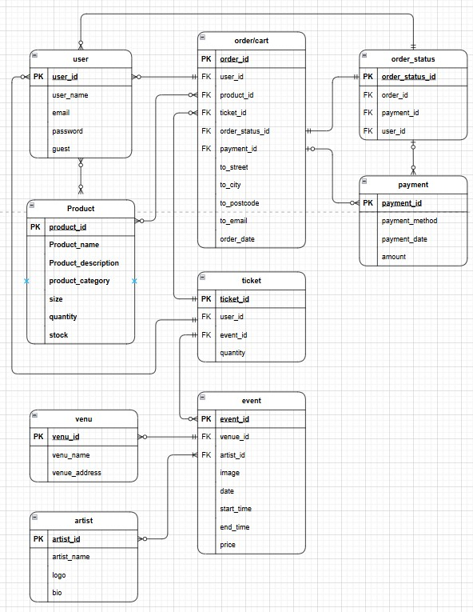

# Searchlight Promotions (Upgrade)

[Insert snip of logo and name]

Table of contents

[Insert images of responsive designs]

## 1. Introduction
This project is the natural progression of my first project *'Searchlight Promotions'*. For my first project I asked a fellow metal head, who runs a music promotion company in and for the Norwich rock and metal scene, if I could design him a website for my project, as he did not have one. After completing and submitting the project he asked me to maintain it going forward as he absolutely loved it. This ultimately meant that I had retained my first customer, and for the conclusion of this course, it is timely that the website is upgraded as the business has developed, my skills have progressed and as a true work-experience piece of practical evidence.

Project 1 can be found here in this *Github* repository (as it was submitted for P1): https://github.com/AxdeKlerk/Searchlight-Promotions, and here as the current working website: www.searchlightpromotions.co.uk. 

What is evident here is that the website has already had various upgrades, notable the inclusion of the link to the *ROXOFF* page using the logo in the navbar, shown here in the mobile view:

## 2. The Aim, Purpose and Goal of the Site

The primary aim of the website has always been to *"create a presence beyond the scope of social media to attract rock and metal fans, as well as emerging [..] rock and metal [artists], to current events happening in Norwich"*(Project 1). 

The website’s purpose is to highlight upcoming events and increase ticket sales for each gig by reaching rock and metal fans who may not follow social media. Additionally, it should clearly communicate the company’s promotional services to attract unsigned rock and metal artists interested in partnering for promotion within Norwich.

The goal of the upgrade is to bring the project to the same level of development and success that Searchlight Promotions has achieved and advance it further by introducing a dedicated online store for merchandise and establishing a proprietary ticketing system for events, eliminating the need for an external booking and payment system via a 3rd party website.

## 3. Planning

### 3.1 Project Statement and ERD

This project involves developing a web application focused on promoting and managing rock and metal music **events** held at a **single fixed venue**. The website allows **users** to either **log in** or browse as **guests**. Logged in users have the the ability to browse upcoming events, **search for merchandise and/or tickets**, add them to a **basket** and **purchase** event tickets and merch.

Each event offers **tickets for sale**, which users can select and add to their **basket** alongside any **merchandise**. The store offers official **products** such as shirts, hoodies, and accessories, which can be **filtered by product description**. Users can then proceed to **checkout**, where they provide payment securely via **Stripe**.

Users will also be able to view and **track the status of their orders**,  
receive **email confirmations** for purchases, and search for **artists and bands** to discover more music.
    

### 3.1.1 Identified Entities (Key Nouns):

-   **User** (covers both registered and guest users)
-   **Event**
-   **Ticket**
-   **Artist/Band**
-   **Product** (Merch)
-   **Order**
-   **OrderStatus**
-   **Payment**
-   **Venue** (fixed, but modelled for potential reuse)
    

### **3.1.2 Key Relationships:**

-   A **User** can place multiple **Orders**
-   Each **Order** can include multiple **Products** and **Tickets** 
-   Each **Ticket** is linked to one **Event**  
-   An **Event** features one or more **Artists / Bands** and belongs to one **Venue**
-   A **Product** may be associated with a single **Order**
-   Each **Order** is linked to one **Payment** and one **OrderStatus**
-   All **Events** occur at the event **Venue**
    
This structured statement sets a clear foundation for building an ERD and a relational database that supports both **ticketing** and **e-commerce features** within a unified system. 

### 3.1.3 ERD (Entity Relationship Diagram)

### 3.2 Wireframes
After completing the first draft of the ERD I draw it out visually as a low fidelity-wireframe for desktops in *Balsamic*, as shown here:

 Once I was happy with what it looked like I converted it into a low-fidelity wireframe for mobiles, as shown here also in *Balsamic*:

Having completed the above I went on to create a high-fidelity wireframe in *Figma*, focusing only on the desk top as everything would be responsive and feature as the low-fidelity wireframe for mobiles depicts above. All 3 versions focus on the functionality of the navbar. Meaning that all 3 were drawn around the navbar and plotted out as progressions. 

The high-fidelity wireframe show below helped me to fully visualise the various screens and how they would look as a finished project. I decided to use some of the styling from my P3 for the tilting merch to create a more visually appealing view of the merch. This came about after doing some research on other websites (mainly rock and metal bands that I know and two festival sites that I go to each year) as to how they displayed their merch on their dedicated pages. 

My findings were mixed, however, most of the websites I looked at seemed to display their merch as an after thought that didn't follow the styling of the rest of their websites. The three stand-out websites, that did follow their overall styling, were *[Blacklakes](https://www.blacklakes.com/merch)*, *[South of Salem](https://www.southofsalem.com/)* and *[Slipknot](https://slipknotmerch.com/)*.

I particularly liked Slipknot's merch page and decided that for this project's website that I would follow Slipknot's layout, but make it different to anything else that I could find, by including the tilt styling.

[insert high-fidelity desktop wireframe]

### 3.3 User Journeys

Once I had completed my wireframes I decided to plot out how I imagined the user would journey through the website. First I plotted the current user journey as it  stands for the current *[Searchlight Promotions](www.searchlightpromotions.co.uk)* website, as shown here:

What stands out is the 'dead ends' (depicted in red) that navigate the user away from the website with the user having to return to the website by clicking back on the website tab. 

I pointed this out to the client as a pitfall to the UX and stated that by upgrading the site to manage its own ticket sales we would create a seamless experience for the user, that kept them on the website for further browsing in the hope that it would encourage further sales and interest.

Below is the new user journey as first imagined. The items in red are still 3rd party websites for payment and email confirmations for logging in, however, with the introduction of a 'thank you' page the user would be returned to the website for further browsing after payment, and after the email confirmations the user will be redirected back to the website.

### 3.4 User Stories

Having plotted the new user journey, user stories were created into separate 'Epics' as show here in the *Kaban* board that follows the *Agile* methodology:

[insert kaban board]

Each 'Epic' represents an App in the project design. The Epics and the user stories are as follows:

#### 3.4.1 User Epic

#### 3.4.2 Core Epic

#### 3.4.3 Products Epic

##### 3.4.3.1 Merch

##### 3.4.3.2 Events

#### 3.4.4 Basket Epic

##### 3.4.4.1 Order Status

##### 3.4.4.2 Payment Method