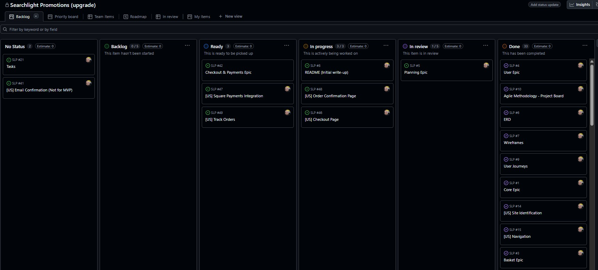

# Searchlight Promotions (Upgrade)

## Table of contents
- [Searchlight Promotions (Upgrade)](#searchlight-promotions-upgrade)
  - [Table of contents](#table-of-contents)
  - [1. Introduction](#1-introduction)
    - [1.1 The Aim, Purpose and Goal of the Site](#11-the-aim-purpose-and-goal-of-the-site)
    - [1.2 Target Audience](#12-target-audience)
  - [2. Planning and Development](#2-planning-and-development)
    - [2.1 Project Statement and ERD](#21-project-statement-and-erd)
    - [2.1.1 Identified Entities (Key Nouns):](#211-identified-entities-key-nouns)
    - [2.1.2 Key Relationships:](#212-key-relationships)
    - [2.1.3 ERD (Entity Relationship Diagram)](#213-erd-entity-relationship-diagram)
    - [2.2 Wireframes](#22-wireframes)
    - [2.3 User Journeys](#23-user-journeys)
    - [2.4 Agile Methodology](#24-agile-methodology)
      - [2.4.1 Epics \& their User Stories](#241-epics--their-user-stories)
    - [2.4.1 Core Epic](#241-core-epic)
      - [2.4.1.1 Site Identification](#2411-site-identification)
      - [2.4.1.2 Navigation](#2412-navigation)
      - [2.4.1.3 Search](#2413-search)
      - [2.4.1.4 Contact Form](#2414-contact-form)
      - [2.4.1.5 Footer](#2415-footer)
      - [2.4.1.6 Base Template](#2416-base-template)
    - [2.4.2 Products Epic](#242-products-epic)
      - [2.4.2.1 Event Listings](#2421-event-listings)
      - [2.4.2.2 Event Detail Page — Ticket Oversell Guardrail](#2422-event-detail-page--ticket-oversell-guardrail)
      - [2.4.2.3 Ticket Availability Tracking — Validation Error Message](#2423-ticket-availability-tracking--validation-error-message)
      - [2.4.2.4 Roxoff Page \& Event Tickets](#2424-roxoff-page--event-tickets)
    - [2.4.3 Basket Epic](#243-basket-epic)
      - [2.4.3.1 Add to Basket](#2431-add-to-basket)
      - [2.4.3.2 View Basket](#2432-view-basket)
      - [2.4.3.3 Update Basket — Basket Quantity Clamping](#2433-update-basket--basket-quantity-clamping)
      - [2.4.3.4 Remove from Basket](#2434-remove-from-basket)
      - [2.4.3.5 Basket Totals](#2435-basket-totals)
    - [2.4.4 User Epic](#244-user-epic)
      - [2.4.4.1 Add Required Email Field to Sign Up](#2441-add-required-email-field-to-sign-up)
      - [2.4.4.2 Sign Up — Input Text Visibility Fix](#2442-sign-up--input-text-visibility-fix)
      - [2.4.4.3 Log In](#2443-log-in)
      - [2.4.4.4 Password Reset](#2444-password-reset)
      - [2.4.4.5 Log Out](#2445-log-out)
      - [2.4.4.6 Profile — Delete Selected Orders](#2446-profile--delete-selected-orders)
      - [2.4.4.7 Email Confirmations (Backlog – Not MVP)](#2447-email-confirmations-backlog--not-mvp)
      - [2.4.4.8 Order Confirmation Page](#2448-order-confirmation-page)
      - [2.4.4.9 Order History in Profile](#2449-order-history-in-profile)
    - [2.4.5 Checkout \& Payments Epic](#245-checkout--payments-epic)
      - [2.4.5.1 Checkout Page — Proceed to Payment Button Routing](#2451-checkout-page--proceed-to-payment-button-routing)
      - [2.4.5.2 Order Summary Event Display](#2452-order-summary-event-display)
      - [2.4.5.3 Delivery and Booking Fees Carry Over to Order Summary](#2453-delivery-and-booking-fees-carry-over-to-order-summary)
      - [2.4.5.4 Checkout Summary Fee and Total Calculations](#2454-checkout-summary-fee-and-total-calculations)
      - [2.4.5.5 Checkout and Payment Summary Totals](#2455-checkout-and-payment-summary-totals)
      - [2.4.5.6 Basket and Checkout Totals Calculation](#2456-basket-and-checkout-totals-calculation)
      - [2.4.5.7 Delivery Charge Message](#2457-delivery-charge-message)
      - [2.4.5.8 Payment Integration and Deployment Testing](#2458-payment-integration-and-deployment-testing)
    - [2.4.6 Webhooks \& Integrations Epic](#246-webhooks--integrations-epic)
      - [2.4.6.1 Invalid Application ID Error](#2461-invalid-application-id-error)
      - [2.4.6.2 Payment Link API](#2462-payment-link-api)
      - [2.4.6.3 Webhook Verification](#2463-webhook-verification)
      - [2.4.6.4 Order Status Update via Square Webhook](#2464-order-status-update-via-square-webhook)
      - [2.4.6.5 Square Webhook Integration](#2465-square-webhook-integration)
      - [2.4.6.6 Square Payment Verification (Admin Action)](#2466-square-payment-verification-admin-action)
      - [2.4.6.7 Square Sandbox Order Creation and Webhook Verification](#2467-square-sandbox-order-creation-and-webhook-verification)
    - [2.4.7 DevOps Epic](#247-devops-epic)
      - [2.4.7.1 Deployment](#2471-deployment)
      - [2.4.7.2 400 Error Page](#2472-400-error-page)
      - [2.4.7.3 500 Error Page — Custom 404 and 500 Pages with Back Navigation](#2473-500-error-page--custom-404-and-500-pages-with-back-navigation)
    - [2.5 Typography and Colour Palette](#25-typography-and-colour-palette)
      - [2.5.1 Typography](#251-typography)
      - [2.5.2 Colour Palette](#252-colour-palette)
  - [3. Features](#3-features)
    - [3.1 Home Page](#31-home-page)
      - [3.1.1 Site Navigation](#311-site-navigation)
      - [3.1.1.1 Navbar](#3111-navbar)
      - [3.1.1.2 Hamburger](#3112-hamburger)
      - [3.1.1.3 User Greeting](#3113-user-greeting)
    - [3.2 About Page](#32-about-page)
    - [3.3 Events Page](#33-events-page)
      - [3.3.1 Events Dropdown](#331-events-dropdown)
    - [3.4 Merch](#34-merch)
      - [3.4.1 Merch List Page](#341-merch-list-page)
      - [3.4.2 Merch Detail Page](#342-merch-detail-page)
      - [3.5 ROXOFF Page](#35-roxoff-page)
    - [3.6 Search Function](#36-search-function)
    - [3.7 Contact Page](#37-contact-page)
    - [3.8 Account Section](#38-account-section)
      - [3.8.1 User Authentication](#381-user-authentication)
      - [3.8.2 Account Orders Page](#382-account-orders-page)
    - [3.9 Basket](#39-basket)
    - [3.10 Order Summary](#310-order-summary)
    - [3.11 Payment Summary](#311-payment-summary)
    - [3.12 404 and 500 Error Pages](#312-404-and-500-error-pages)
    - [3.13 Summary](#313-summary)
  - [4. Debugging, Testing, Deployment and Future Developments](#4-debugging-testing-deployment-and-future-developments)
    - [4.1 Debugging](#41-debugging)
    - [4.2 Testing](#42-testing)
    - [4.3 Deployment](#43-deployment)
      - [4.3.1 Create a GitHub Repository](#431-create-a-github-repository)
      - [4.3.2 Clone the Repository to VS Code](#432-clone-the-repository-to-vs-code)
      - [4.3.3 Create and Activate a Virtual Environment](#433-create-and-activate-a-virtual-environment)
      - [4.3.4 Install Project Dependencies](#434-install-project-dependencies)
      - [4.3.5 Prepare the Project for Heroku](#435-prepare-the-project-for-heroku)
      - [4.3.6 Set Up a Heroku Account and CLI](#436-set-up-a-heroku-account-and-cli)
      - [4.3.7 Create a Heroku App](#437-create-a-heroku-app)
      - [4.3.8 Push Your Project to Heroku](#438-push-your-project-to-heroku)
      - [4.3.9 Configure Environment Variables on Heroku](#439-configure-environment-variables-on-heroku)
      - [4.3.10 Final Project Setup on Heroku](#4310-final-project-setup-on-heroku)
      - [4.3.11 Open Your Live Site](#4311-open-your-live-site)
    - [4.4 Future Developments](#44-future-developments)
      - [4.4.1 Email Verification and Account Confirmation](#441-email-verification-and-account-confirmation)
      - [4.4.2 Enhanced Order Confirmation Emails](#442-enhanced-order-confirmation-emails)
      - [4.4.3 Merchandise and Ticket Download Functionality](#443-merchandise-and-ticket-download-functionality)
      - [4.4.4 Admin Dashboard Enhancements](#444-admin-dashboard-enhancements)
      - [4.4.5 Payment Gateway Expansion](#445-payment-gateway-expansion)
      - [4.4.6 SEO and Performance Optimisation](#446-seo-and-performance-optimisation)
      - [4.4.7 Accessibility and UX Refinement](#447-accessibility-and-ux-refinement)
      - [4.4.8 Testing and Continuous Integration](#448-testing-and-continuous-integration)
      - [4.4.9 Live Launch Phase](#449-live-launch-phase)
      - [4.4.10 Summary](#4410-summary)
  - [5. Credits and Acknowledegements](#5-credits-and-acknowledegements)
    - [5.1 Credits](#51-credits)
    - [5.2 Acknowledgements](#52-acknowledgements)

---

## 1. Introduction

This project is the natural progression of my first submission, *'Searchlight Promotions'*. For my first project I asked a fellow metal head, who runs a music promotion company in and for the Norwich rock and metal scene, if I could design him a website for my project, as he did not have one. After completing and submitting the project he asked me to maintain it going forward as he absolutely loved it. This ultimately meant that I had retained my first customer, and for the conclusion of this course, it is timely that the website is upgraded as the business has developed, my skills have progressed and as a true work-experience piece of practical evidence.

Project 1 can be found here in my *Github* repository (as it was submitted for P1): https://github.com/AxdeKlerk/Searchlight-Promotions, and here as the current working website: https://www.searchlightpromotions.co.uk. 

What is evident here is that the website has already had various upgrades, notably the inclusion of the link to the *ROXOFF* page using the logo in the navbar, shown here in the mobile view, along with the upkeep of the gig listings:

**Live Site:** [https://slp-upgrade-910f8354c673.herokuapp.com](https://slp-upgrade-910f8354c673.herokuapp.com)  
**Repository:** [https://github.com/AxdeKlerk/SLP](https://github.com/AxdeKlerk/SLP)

### 1.1 The Aim, Purpose and Goal of the Site

The primary aim of the website has always been to *"create a presence beyond the scope of social media to attract rock and metal fans, as well as emerging [..] rock and metal [artists], to current events happening in Norwich"*(Project 1). 

The website’s purpose is to highlight upcoming events and increase ticket sales for each gig by reaching rock and metal fans who may not follow social media. Additionally, it should clearly communicate the company’s promotional services to attract unsigned rock and metal artists interested in partnering for promotion within Norwich.

The goal of the upgrade is to bring the project to the same level of development and success that Searchlight Promotions has achieved and advance it further by introducing a dedicated online store for merchandise and establishing a proprietary ticketing system for events, eliminating the need for an external booking and payment system via a 3rd party website.

### 1.2 Target Audience

The target audience is niche and focuses only on the rock and metal musicians and fans in Norwich. It is specifically aimed at an aging demographic of rock and metal fans who don’t rely on social media for gig information in Norwich, the new rise in younger rock and metal fans who are looking to support up-and-coming artists locally, emerging (and unsigned) rock and metal artists looking for promotion in Norwich, other music promoters who may want to collaborate, as well as music journalists wanting to cover gigs.

---

## 2. Planning and Development

### 2.1 Project Statement and ERD

This project involves developing a web application focused on promoting and managing rock and metal music **events** held at a **single fixed venue**. The website allows **users** to browse as **guests** or **log in** for a personalised experience. Logged in users have the the ability to browse upcoming events, **search for merchandise and/or tickets**, add them to a **basket** and **purchase** event tickets and merch.

Each event offers **tickets for sale** that users can add to their **basket**, alongside any **merchandise**. The store offers official **products** such as shirts, hoodies, and accessories, which can be **filtered by product description**. Users can then proceed to **checkout**, where they provide payment securely via **Square**.

Users will also be able to view and **track the status of their orders**,  
receive **email confirmations** for purchases, and search for **artists and bands** to discover more music.
    

### 2.1.1 Identified Entities (Key Nouns):

-   **User** (covers both registered and guest users)
-   **Event**
-   **Ticket**
-   **Artist/Band**
-   **Product** (Merch)
-   **Order**
-   **OrderStatus**
-   **Payment**
-   **Venue** (fixed, but modelled for potential reuse)
    

### 2.1.2 Key Relationships:

-   A **User** can place multiple **Orders**
-   Each **Order** can include multiple **Products** and **Tickets** 
-   Each **Ticket** is linked to one **Event**  
-   An **Event** features one or more **Artists / Bands** and belongs to one **Venue**
-   A **Product** may be associated with a single **Order**
-   Each **Order** is linked to one **Payment** and one **OrderStatus**
-   All **Events** occur at the event **Venue**
    
This structured statement sets a clear foundation for building an ERD and a relational database that supports both **ticketing** and **e-commerce features** within a unified system. 

### 2.1.3 ERD (Entity Relationship Diagram)

---

### 2.2 Wireframes
After completing the first draft of the ERD I drew it out visually as a low fidelity-wireframe for desktops in *Balsamic*, as shown here:

 Once I was happy with what it looked like I converted it into a low-fidelity wireframe for mobiles, as shown here also in *Balsamic*:

Having completed the above I went on to create a high-fidelity wireframe in *Figma*, focusing only on the desktop as everything would be responsive and feature as the low-fidelity wireframe for mobiles depicts above. All 3 versions focus on the functionality of the navbar. Meaning that all 3 were drawn around the navbar and plotted out as progressions. 

The high-fidelity wireframe show below helps to fully visualise the various screens and how they would look as a finished project. I decided to use some of the styling from my P3 for the tilting merch to create a more visually appealing view of the merch. This came about after doing some research on other websites (mainly rock and metal bands that I know and two festival sites that I go to each year) as to how they displayed their merch on their dedicated pages. 

The findings were mixed, however, most of the websites seemed to display their merch as an after thought that didn't follow the styling of the rest of their websites. The three stand-out websites, that did follow their overall styling, were *[Blacklakes](https://www.blacklakes.com/merch)*, *[South of Salem](https://www.southofsalem.com/)* and *[Slipknot](https://slipknotmerch.com/)*.

Slipknot's merch page stood out amoungst the rest and the decision was made that, this project's website would follow Slipknot's style of layout, but make it different to anything else that could be found, by including the tilt styling.

---

### 2.3 User Journeys

Having completed the wireframes, user journeys were plotted out as imagined the user would journey would be through the website. First, the  current user journey was plotted out, from the *[Searchlight Promotions](www.searchlightpromotions.co.uk)* website, as shown here:

What stood out were the 'dead ends' (depicted in red) that navigate the user away from the website with the user having to return to the website by clicking back on the website tab. This blocks the user from an easy transition back to the website and considered 'bad' UI/UX.

This was pointed out to the client as a pitfall to the UX and stated that by upgrading the site to manage its own ticket sales we would create a seamless experience for the user, that kept them on the website for further browsing in the hope that it would encourage further sales and interest.

Below is the new user journey as first imagined. The items in red are still 3rd party websites for payment and email confirmations for logging in, however, with the introduction of a 'thank you' page the user would be returned to the website for further browsing after payment. After the email confirmation, the user will be redirected back to the website automatically.

---

### 2.4 Agile Methodology

This project was developed using Agile methodologies to ensure a user-focused, iterative, and flexible development process. Key Agile principles were applied throughout.

Having plotted the new user journey and user stories, 'Epics' were extracted from the user journey into the categories that follow. Each 'Epic' represents an App in the *Django* project design. Under each 'Epic', user stories were created using the "As a **user** I want to **action** so that I can **benefit**" statement to ensure a user story driven development and that all development decisions were tied directly to user needs. From each user story actionable tasks were created representing the acceptance criteria for each user story. 

The project was created in *[Github](https://github.com/users/AxdeKlerk/projects/7)*.

#### 2.4.1 Epics & their User Stories

Each epic was added to the Project Board using labels as can be seen here:

From the collapsable Core Epic, for example, the below details a description of the covered features, with the first 3 user stories below, and the tasks listed below the user stories:

The below shows the Site Identification User Story as well as its corresponding Tasks List, as an example:

The below is a representation of the Kanban board and all its components. As the project developed more user stories and tasks were created. Throughout the design of the website this project board was referenced to keep the scope of the project realistic and on track. For convenience the project board can be found here:

 

Below details all the Epic headings with their corresponding user stories. All user stories were tested and can be found in the [TESTING.md](TESTING.md).

### 2.4.1 Core Epic  

#### 2.4.1.1 Site Identification  
 
As a **user** I want to **land on the website and immediately recognise that it is for a rock and metal music promotion company** so that I **know I am in the right place**.  

#### 2.4.1.2 Navigation  
 
As a **user** I want to **be able to navigate between Home, About, Event, Merch, Contact Form and Basket** so that I **can reach any section quickly**.  

#### 2.4.1.3 Search  
  
As a **user** I want to **be able to search for artists, merch and venues** so that I **can navigate quickly to my selected choice**.  

#### 2.4.1.4 Contact Form  
  
As a **user** I want to **contact the promotions company** so that **my query reaches the right place**.  

#### 2.4.1.5 Footer  
  
As a **user** I want to **see a basic footer with copyright information** so that I **can know where the end of the page is by the consistent copyright protection displayed beneath**.  

#### 2.4.1.6 Base Template  
  
As a **developer** I want a **reusable base.html template** so that **all pages share the same layout, styling, and design consistency**.  

### 2.4.2 Products Epic  

#### 2.4.2.1 Event Listings  
  
As a **user** I want to **view all upcoming events** so that I **can decide which ones to attend**.  

#### 2.4.2.2 Event Detail Page — Ticket Oversell Guardrail  
  
As a **fan buying tickets** I want **the checkout system to stop me from purchasing more tickets than the event’s available capacity** so that I **cannot buy a ticket to an oversold event with a clear message so that I clearly understand why my order cannot proceed**.  

#### 2.4.2.3 Ticket Availability Tracking — Validation Error Message  
  
As a **user**, I want to **be prevented from purchasing more tickets than are available for an event**, so that I **don’t end up buying tickets for an event that is already at the event's capacity and I want to receive a clear error message before purchasing my ticket**.  

#### 2.4.2.4 Roxoff Page & Event Tickets  
  
As a **user**, I want to **access the Roxoff page** so that **I can easily view and purchase tickets for upcoming events promoted under the Roxoff brand**.  

### 2.4.3 Basket Epic  

#### 2.4.3.1 Add to Basket  
  
As a **user**, I want to **add event tickets or merchandise to my basket** so that **I can purchase them later**.  

#### 2.4.3.2 View Basket  
  
As a **user**, I want to **view my basket** so that I **can see the items I intend to purchase**.  

#### 2.4.3.3 Update Basket — Basket Quantity Clamping  
  
As a **developer**, I want **the basket to only allow item quantities between 1 and 6** so that **the system is not broken by invalid or malicious inputs**.  

#### 2.4.3.4 Remove from Basket  
  
As a **user**, I want **to delete items from my basket** so that I **don’t purchase items I no longer want**.  

#### 2.4.3.5 Basket Totals  
  
As a **user**, I want to **see my basket total** so that I **know the total cost before checkout**.  

### 2.4.4 User Epic  

#### 2.4.4.1 Add Required Email Field to Sign Up  
  
As a **new user**, I want to **provide my email address during registration** so that I **can receive receipts and e-tickets linked to my account**.  

#### 2.4.4.2 Sign Up — Input Text Visibility Fix  
  
As a **user signing up or logging in** I want **the text I type into input fields to be clearly visible in black** so that I **can easily read what I am entering without confusion**.  

#### 2.4.4.3 Log In  
  
As a **registered user**, I want to **log in** so that I **can access my account and complete purchases**.  

#### 2.4.4.4 Password Reset  
  
As a **registered user**, I want to **be able to reset my password if I forget it** so that I **can regain access to my account**.  

#### 2.4.4.5 Log Out  
  
As a **logged in user**, I want to **log out** so that **my account is secure when I leave the site**.  

#### 2.4.4.6 Profile — Delete Selected Orders  
  
As a **logged-in user**, I want to **be able to select one or more pending orders from my profile page and delete them**, so that I **can remove orders I no longer wish to keep**.  

#### 2.4.4.7 Email Confirmations (Backlog – Not MVP)  
  
As a **registered user**, I want to **receive email confirmations** so that I can **verify my account and trust the platform**.  

#### 2.4.4.8 Order Confirmation Page  
  
As a **user**, I want to **see an order confirmation page after completing my payment** so that I can **be sure my order has been successfully processed and view a summary of my purchase**.  

#### 2.4.4.9 Order History in Profile  
  
As a **logged-in user**, I want to **view my past orders in my profile page** so that I can **keep track of my purchase history and review order details at any time**.  

### 2.4.5 Checkout & Payments Epic  

#### 2.4.5.1 Checkout Page — Proceed to Payment Button Routing  
  
As a **user**, I want the **""Proceed to Payment"" button on my profile page to take me directly to the checkout page** so that I **can complete payment for my selected order**.  

#### 2.4.5.2 Order Summary Event Display  
  
As a **user**, I want to **see clear and accurate details of my event orders in the checkout and payment summary** so I can **confirm I’m paying for the correct gig before completing my purchase**.  

#### 2.4.5.3 Delivery and Booking Fees Carry Over to Order Summary  
  
As a **user**, I want **delivery and booking fees shown in my basket to be accurately carried over to my checkout summary** so that I **always see the correct final total before payment**.  

#### 2.4.5.4 Checkout Summary Fee and Total Calculations  
  
As a **user**, I wanted the **checkout summary to clearly display item costs including booking and delivery fees**, so that I can **understand exactly how my total is calculated before payment**.  

#### 2.4.5.5 Checkout and Payment Summary Totals  
 
As a **user**, I wanted to **see accurate per-item totals that include all booking and delivery fees on both the checkout and payment summary pages** so that I can clearly understand the full cost before completing my order.  

#### 2.4.5.6 Basket and Checkout Totals Calculation  
  
As a **user**, I want the **basket and checkout totals to include the correct booking and delivery fees for each item** so that I can **see accurate costs before payment**.  

#### 2.4.5.7 Delivery Charge Message  
  
As a **user**, I want to **clearly see how delivery costs are calculated when buying multiple merch items** so that I **understand why my delivery fee changes at checkout**.  

#### 2.4.5.8 Payment Integration and Deployment Testing  
  
As a **user**, I want to **complete a secure checkout using the *Square* payment form** so that I can **confidently pay for my order online**.  

### 2.4.6 Webhooks & Integrations Epic  

#### 2.4.6.1 Invalid Application ID Error  
  
As a **developer**, I wanted to **render the *Square* card input in my checkout page** so that I **could generate a token from a sandbox card and confirm the frontend to backend tokenisation flow worked correctly**.  

#### 2.4.6.2 Payment Link API  
  
As a **user**, I wanted to **be redirected to a *Square* checkout page when I clicked “Proceed to Payment” from my profile**, so that I **could complete my order securely**.  

#### 2.4.6.3 Webhook Verification  
 
As a **developer**, I wanted to **confirm that my webhook endpoint correctly verified *Square*’s signature** so that **only legitimate events could trigger updates**.  

#### 2.4.6.4 Order Status Update via Square Webhook  
  
As a **user**, I want **my order status to automatically update to “paid” once my *Square* payment completes**, so that I **know my transaction has been confirmed**.  

#### 2.4.6.5 Square Webhook Integration  
  
As a **site owner**, I want **my *Django* application to securely receive and process payment webhooks from *Square***, so that **order statuses automatically update to “paid” when payments are completed**.  

#### 2.4.6.6 Square Payment Verification (Admin Action)  
  
As a **site owner**, I want to **verify payment statuses directly from *Django* Admin by checking *Square*’s records**, so that I can **confirm completed transactions even if a webhook fails**.  

#### 2.4.6.7 Square Sandbox Order Creation and Webhook Verification  
  
As a **site owner**, I want **my checkout process to automatically create *Square* orders and payments in the sandbox environment** so that I can **verify real-time payment updates before going live**.  

### 2.4.7 DevOps Epic  

#### 2.4.7.1 Deployment  
  
As a **developer**, I want to **deploy the application to *Heroku*** so that **users can access the live site**.  

#### 2.4.7.2 400 Error Page  
  
As a **user**, I want to **see a friendly 400 error page when I make a bad request** so that **I am not shown a confusing error message**.  

#### 2.4.7.3 500 Error Page — Custom 404 and 500 Pages with Back Navigation  
  
As a **user**, I want to **see branded and consistent error pages when something goes wrong, with a back button that takes me to my previous page**, so I **don’t lose my place on the site**. 

---

### 2.5 Typography and Colour Palette

The following design choices were made to ensure visual consistency, accessibility, and brand recognition across all pages. The colour palette and typography together create a unified aesthetic that reflects the energy and identity of the Norwich rock and metal scene.  

#### 2.5.1 Typography

The website uses a combination of *Protest Revolution* for the *Searchlight Promotions* logo and *Geist Mono* for body text, both sourced from *Google Fonts*. These fonts were chosen for their modern, legible appearance and compatibility with the high-contrast colour palette. Together, they balance the bold attitude of the brand with clean readability across desktop and mobile views. Both fonts were carried over from the first iteration of *Searchlight Promotions*.

#### 2.5.2 Colour Palette

The colour palette follows a dark rock aesthetic consistent with *Searchlight Promotions’* brand identity. A dominant black (`#000000`) background sets the tone, contrasted with off-white (`#F5F5F5`) text for readability and a neon green accent (`#11ED73`) used throughout for borders, buttons, and hover effects. In addition the colour (`#888`) was used for placeholder text and (`#E63946`) was used for 'red' flash messages as well as the delete buttons rather than (`#FF0000`) to avoid any colour bleeding due to it's brightness. This combination reinforces the energy of live rock and metal shows while maintaining professional clarity across all devices.

---

## 3. Features

The features of *Searchlight Promotions (Upgrade)* were designed to showcase both functionality and usability while staying true to the brand’s heavy rock identity. Each section of the site serves a clear purpose — from event promotion and merch sales to ticket booking and secure payments. The layout, styling, and navigation all work together to create a professional, responsive, and accessible experience for users across devices.  

### 3.1 Home Page

The home page immediately sets the tone and identity of *Searchlight Promotions*, combining the logo, hero image, and promotional tagline to confirm the site’s focus on rock and metal events. It features a clean navigation bar at the top and a footer that stays consistent across all pages. The layout draws users toward the latest events and merch, encouraging deeper browsing throughout the site.

#### 3.1.1 Site Navigation  

Site navigation is handled through a persistent Bootstrap navbar that adapts across all screen sizes. It gives users instant access to every key section of the site — Home, About, Events, Merch, Roxoff, Search, Contact, Account and the Basket — ensuring simple and predictable movement throughout. 

#### 3.1.1.1 Navbar  

The navbar contains the site logo, core links, and the *Roxoff* logo link that takes users directly to ticketed events. It uses *Bootstrap*’s responsive collapse behaviour so that on smaller screens, links are tucked neatly into the hamburger menu.  

Additionally, the three distinct navbar elements — the logo header, the navigation links, and the user greeting — have been separated but remain fixed in position. This means that as the user scrolls up or down the page, each bar stays visible with intentional spacing between them to break up what would otherwise be a large black block across the top of the screen. While unconventional, this design choice was a deliberate decision to introduce more visual rhythm and make the header feel lighter and more dynamic rather than a solid, heavy band of black.  

#### 3.1.1.2 Hamburger  

On mobile, the navbar collapses into a hamburger icon that slides open as an off-canvas menu. The design maintains full site accessibility on small screens without cluttering the layout.

#### 3.1.1.3 User Greeting  

When logged in, the navbar greets the user by name, helping to reinforce a sense of personalisation. This is handled through a *Django* context processor, which pulls the logged-in user’s information into the base template so that it displays across the entire site. 

---

### 3.2 About Page  

The About page provides a brief overview of *Searchlight Promotions* and its work within the Norwich rock and metal community. It includes the main promotional image and concise text about the company’s purpose, keeping the design minimal but true to the site’s overall branding.

---

### 3.3 Events Page  

The Events page dynamically displays all upcoming events pulled from the database through *Django*’s ORM. Each event card includes an image, title, artist links, venue, and ticket information. Cards are fully responsive and stack neatly on smaller screens, giving users a consistent experience across devices. Each artist, in green, is "click-able" and directs the user to their bio.

#### 3.3.1 Events Dropdown  

A dropdown filter at the top of the page allows users to view events by month. This is implemented through a simple query parameter passed to the *Django* view, filtering the event queryset into previous and upcoming gigs, before rendering.

---

### 3.4 Merch  

The Merch section showcases the available merchandise for sale, using *Bootstrap* card layouts for consistency with the Events page. Products are retrieved dynamically from the database and include product images, descriptions, prices, and links to the detail page.  

#### 3.4.1 Merch List Page  

This view lists all available products with a clean card design and quick “View” buttons. The layout automatically adapts to mobile screen widths using *Bootstrap* grid classes. Pagination is also applied to ensure users can browse comfortably without long scrolls. 

#### 3.4.2 Merch Detail Page  

Each product card links to a detailed product page where users can view an enlarged image, product description, and price. Backend logic dynamically retrieves the selected product using its primary key and displays it through a *Django* detail view.

---

#### 3.5 ROXOFF Page

The ROXOFF page was created as a dedicated promotional section within the site, showcasing *Searchlight Promotions*’ flagship annual event. It highlights the full festival lineup, venue details, and individual day tickets, using a bold visual identity that mirrors the festival’s branding.  

Each event card on this page is styled to match the darker, heavier tone of the ROXOFF artwork, with red and green neon accents that connect back to the main site palette. All event data — including artist line-ups, venue information, gig dates, and ticket pricing — are dynamically pulled from the database through *Django* model relationships, ensuring that updates in the admin panel automatically appear on the front end.  

Below shows the full ROXOFF page layout with the main event poster, detailed artist lineup, and dynamic ticket cards generated from the database. Again, all artists names are links to their bios

---

### 3.6 Search Function  

The search feature allows users to find artists, venues, or merchandise directly from the dropdown in the main navigation bar. Each category has its own dedicated search input field styled to match the site’s neon theme, with subtle green borders and black backgrounds for visual consistency.  

Search queries are handled through *Django* view logic, which checks the selected input type (artist, venue, or merch) and filters results dynamically from the corresponding model. This ensures that all searches are fast, relevant, and accurate without needing separate pages for each search type.  

Below shows the search dropdown menus for both desktop and mobile, with individual input fields for Artist, Venue, and Merch.  

  

Search results for “a” (artist), “e” (venue), and “hoodie” (merch) demonstrate the live database filtering and consistent card styling across all result types.  

 

---

### 3.7 Contact Page  

The Contact page provides users with a straightforward and visually consistent way to reach *Searchlight Promotions*. The page includes a short, informal introduction written in the same down-to-earth tone as the brand’s social presence, encouraging users to “tap, tap, tap (below)” to get in touch.  

The form itself captures the user’s **first name**, **last name**, **email**, **phone number**, and **message**, maintaining a minimalist layout with the same green-on-black neon theme used throughout the site. A direct link to the company’s ***Facebook page*** is also included for users who prefer to connect via social media.  

From a backend perspective, the form is wired through *Django*’s view logic and template rendering, validating all input fields before submission. Although messages are not currently stored in the database (to maintain simplicity for MVP), all data is correctly formatted and ready for future backend integration. 

Below shows the Contact page layout with the form fields, “Send” button, and external *Facebook* link for additional engagement.

Upon submission, the form triggers a dual email process:  
- A notification email is sent to the site owner containing the user’s message details.  
- A confirmation email is automatically sent to the user, reassuring them that their message has been received. 

 

After sending, users are redirected to a dedicated **Thank You** page for a smooth, professional experience.  

---

### 3.8 Account Section  

The Account section manages all user authentication and profile interactions through a clean dropdown in the navbar. Depending on login status, users either see **Log In**, **Sign Up**, and **Forgot Password**, or —once logged in— **Orders** and **Logout**.  

#### 3.8.1 User Authentication

The authentication flow uses *Django*’s built-in `User` model and `auth` views, ensuring secure session management and form validation. Each page (login, signup, reset password, and forgot username) was fully restyled to match the site’s rock and metal aesthetic — black backgrounds, neon green typography, and consistent spacing.  

When a user logs in, a personalised greeting (“Hello [username]”) appears in the navbar, confirming successful authentication. Upon logout, the dropdown resets to its default options.  

The below images show:  
- The dropdown menu options for logged-out and logged-in users  
- The login and password reset screens  
- The confirmation and success pages in sequence, demonstrating the complete authentication flow  
- The final logged-in greeting and success confirmation page
- Signup page 

  
  
  
  
  
  

#### 3.8.2 Account Orders Page

Once logged in, users can access their **Orders** via the Account dropdown. The Orders page is divided into two clear sections: **Orders in Progress** and **Order History**.  

The **Orders in Progress** section lists any active, unpaid orders. Each order includes a breakdown of items, quantities, and total costs, along with a **Checkout** button for quick access to payment. Users can also select and delete specific pending orders if they no longer wish to proceed — a useful feature for managing incomplete transactions.  

The **Order History** section displays all completed and paid orders. Each entry clearly shows the order number, completion date, and all associated items, with pricing details to maintain transparency.  

From a backend perspective, this page pulls data directly from the custom **Order** model, filtered by the currently logged-in user. The two categories — “in progress” and “completed” — are dynamically generated based on the order status field.  

---

### 3.9 Basket  

The Basket section brings together all user selections — both **event tickets** and **merchandise** — in a clear, minimal layout designed to keep checkout simple. Each item includes its image, name, quantity selector, price, and any associated **booking** or **delivery** fees.  

At the top, a **“Continue Shopping”** button allows users to easily return to browsing events or merch without losing their basket progress.  

A key feature of this system is its **basket persistence**. Even if the user navigates away from the site or proceeds to the payment page and returns, their previous basket is automatically restored. This ensures users don’t lose their items due to navigation errors or incomplete transactions — a critical UX consideration for e-commerce reliability.  

From a backend perspective, this is handled by storing basket data in the session and syncing it with the user’s active **Order** object. When a user revisits the basket or logs back in, Django checks for an active “pending” order and restores it to the template.  

The **Delete** button beside each item allows for instant removal, and basket totals dynamically update to reflect any delivery or booking fee adjustments.  

The dropdown under **Basket** in the navbar provides quick access to both the **View Basket** and **Order Summary** pages for a smooth flow from shopping to checkout.  

---

### 3.10 Order Summary  

The **Order Summary** page provides users with a clear overview of their pending order before they proceed to payment. Each order displays the list of items, quantities, prices, and any associated **delivery** or **booking** fees, ensuring complete transparency.  

The layout is intentionally minimal, using the same neon-green borders and monospaced font to keep the styling consistent with the rest of the site. The total cost is calculated dynamically and displayed at the bottom of the order box.  

A **“Back to Basket”** button at the top allows users to return and make adjustments before continuing to payment, while the **“Proceed to Payment”** button initiates the secure checkout process via *Square*.  

Behind the scenes, the page pulls order data directly from the **Order** and **OrderItem** models, filtered by the current user and order ID. This guarantees that only the logged-in user can access and view their order details.

---

### 3.11 Payment Summary  

The **Payment Summary** page finalises the checkout process by displaying the user’s order items, total cost, and all relevant billing and shipping details before confirming payment.  

At the top, users see a breakdown of their order, including each item’s price and any applicable **delivery** or **booking** fees, carried forward directly from the Basket and Order Summary stages.  

The **Billing Details** form pre-fills automatically from the user’s saved profile, reducing friction during checkout. Users can update their name, address, and contact information if required. Below this, two radio buttons allow users to either use their billing address for shipping or enter a separate shipping address if needed.  

The secure **Square Payment Form** is embedded directly within the page, allowing for seamless payment processing. Users simply enter their card details (number, expiry, and CVV) to complete the transaction. 

Once submitted, the payment data is securely tokenised and sent to the backend for verification, ensuring sensitive information is never stored on the server. A small message below the payment button confirms that transaction fees are included in the final total.  

The overall layout remains consistent with the site’s minimalist neon theme, maintaining focus and clarity throughout the checkout experience.

Once completed the user is given a confirmation that their order has been made.

---

### 3.12 404 and 500 Error Pages

Both custom error pages maintain the same dark neon aesthetic and navigation consistency as the rest of the site, ensuring that even error states feel on-brand and user-friendly.  

- **404 Page:** Displays a friendly “Page Not Found” message when a user visits a non-existent URL. Includes a direct link back to the homepage to encourage continued navigation. 

- **500 Page:** Provides a clear “Server Error” message in the same style, reassuring users that the issue is temporary while keeping them within the branded environment.

 

Both templates are stored in the `base/` directory and extend the main `base.html` layout so that the navbar and footer remain visible. This ensures a seamless transition between normal site content and error handling.

---

### 3.13 Summary  

All features across the site were designed with simplicity, speed, and responsive behaviour in mind. Every page follows a consistent visual theme, ensuring a cohesive experience for both fans and artists on any device. The combination of *Bootstrap*’s responsive utilities and *Django*’s backend logic keeps the site clean, efficient, and scalable for future upgrades.  

---

## 4. Debugging, Testing, Deployment and Future Developments

A critical production database dependency issue encountered during initial assessment and its resolution are documented in [DEBUGGING.md](DEBUGGING.md) (Entry 4.1.8 & 4.1.9).

### 4.1 Debugging

Please refer to the debugging documentation for detailed descriptions of all bugs found, fixed and learned from. It can be found here: [DEBUGGING.md](DEBUGGING.md)

### 4.2 Testing

Please refer to the testing documentation for detailed descriptions of the tests completed found here: [TESTING.md](TESTING.md)

### 4.3 Deployment

This section outlines the full process for deploying this project from *GitHub* to your local machine using *VS Code*, and then hosting it live on *Heroku*.

Database provider updated to ensure production stability during assessment. Application verified with live authentication and admin access.

This project uses *Django* with a *PostgreSQL* database (*Neon*), *Cloudinary* for media storage, and *Square* for payment processing. Deployment is handled via *Heroku*.

#### 4.3.1 Create a GitHub Repository

- Go to *GitHub* and click the "+" icon to create a new repository
- Name the repository and optionally add a description
- Choose "Public" or "Private"
- Do not initialize with a README, .gitignore, or license
- Click "Create repository"

#### 4.3.2 Clone the Repository to VS Code

- Open *VS Code* and its terminal
- Navigate to the folder where you want your project
- Copy the repository's URL from *GitHub* and use the "Clone Git Repository" option in *VS Code*
- Open the project folder in *VS Code*
- git clone <repository-url>
- cd <project-folder>
  
#### 4.3.3 Create and Activate a Virtual Environment

- In your terminal, create a virtual environment inside your project folder
- Activate the environment depending on your system (*Windows*, *Mac*, or *Linux*)
- Your terminal prompt will change to show the environment is active
- python -m venv .venv
- source .venv/bin/activate  # Mac/Linux
- .venv\Scripts\activate     # Windows

#### 4.3.4 Install Project Dependencies

- Use the requirements.txt file to install all necessary *Python* packages:

    -  *Django* – Core web framework for building the project
    -  *Gunicorn* – WSGI HTTP server for running *Django* on *Heroku*
    - *dj-database-url* – Database configuration
    -  *psycopg2-binary* – *PostgreSQL* adapter
    -  *whitenoise* – Serves static files efficiently in production
    -  *cloudinary* – Handles image storage
    -  *django-cloudinary-storage* – Integrates *Cloudinary* with *Django*'s media and static file handling
    - *django-allauth* – (Optional) For user authentication, if used
  
- If this file doesn’t exist yet, install your packages manually and then generate the file
    - pip install -r requirements.txt

#### 4.3.5 Prepare the Project for Heroku

- .env / env.py is used locally and not committed to *Git*
- Create a "Procfile" at the root of your project with the necessary *Heroku* command to run the app
- Ensure "gunicorn", "dj-database-url", and "psycopg2-binary" are installed
- Update your "requirements.txt" file with any new packages
- Commit all changes to *Git*

- Procfile contents:
    - web: gunicorn config.wsgi

#### 4.3.6 Set Up a Heroku Account and CLI

- Create an account at *Heroku.com*
- Download and install the *Heroku* CLI for your operating system
- Use the CLI to log into your *Heroku* account
- Command:
    - heroku login

#### 4.3.7 Create a Heroku App

- Use the *Heroku* CLI to create a new app with a unique name
- *Heroku* will generate a remote *Git* URL for your project
- Command:
    - heroku create <heroku-app-name>
  
This creates a *Heroku* application for the *Django* project (SLP), not individual *Django* apps within the project.

#### 4.3.8 Push Your Project to Heroku

- Add *Heroku* as a *Git* remote if needed
- Push your local codebase to *Heroku*’s remote repository
- Command:
    - git push heroku main (or master, depending on branch)

#### 4.3.9 Configure Environment Variables on Heroku

- Go to your *Heroku* Dashboard and open your app
- Under "Settings", click "Reveal Config Vars"
- Add the following variables:
    - DEBUG
    - SECRET_KEY
    - ALLOWED_HOSTS
    - DATABASE_URL
    - CLOUDINARY_URL
    - SQUARE_ACCESS_TOKEN
    - SQUARE_LOCATION_ID
    - SQUARE_SIGNATURE_KEY
    - EMAIL_HOST_USER (if used)
    - EMAIL_HOST_PASSWORD (if used)
- Sensitive values are never committed to version control
  
#### 4.3.10 Final Project Setup on Heroku

- Run your database migrations from the *Heroku* CLI
- Create a "superuser" account to access the *Django* admin panel
- "Collectstatic" files if not done automatically
- Commands:
    - heroku run python manage.py migrate
    - heroku run python manage.py createsuperuser
    - heroku run python manage.py collectstatic

#### 4.3.11 Open Your Live Site

- Use the *Heroku* CLI or browser to open your app
- Your project is now live
- Command:
    - heroku open

Deployment was successful, and the live site runs stably with DEBUG=False, confirming that static files, media storage, and payment functionality operate correctly in production.

This project can be cloned, run locally, and deployed using the steps above.

--- 

### 4.4 Future Developments

This section outlines planned enhancements and refinements to extend the functionality, scalability, and user experience of *Searchlight Promotions (SLP)* beyond the current MVP release. These features were deferred to maintain submission deadlines and ensure a stable, production-ready deployment.

#### 4.4.1 Email Verification and Account Confirmation  
To strengthen account security and build user trust, future versions will implement a full email confirmation workflow using *Django*’s built-in email verification or *django-allauth*.  
- Users will receive a confirmation email upon registration with a secure activation link.  
- Unverified accounts will have limited access until activation.  
- This addition will improve authenticity, prevent spam registrations, and enhance compliance with best security practices.

#### 4.4.2 Enhanced Order Confirmation Emails  
Current confirmation emails provide essential order summaries only. Future versions will:  
- Include detailed lists of purchased items (tickets and merchandise).  
- Display event details such as date, venue, and start time.  
- Include estimated delivery information for physical goods.  
- Integrate optional QR codes or ticket barcodes for event entry.  

#### 4.4.3 Merchandise and Ticket Download Functionality  
Users will be able to download digital tickets or receipts directly from their profile page.  
- Orders in “Paid” status will show a **Download Ticket/Invoice** button.  
- PDF generation will be handled using *WeasyPrint* or *ReportLab*.  
- This provides a self-service option, reducing admin workload.

#### 4.4.4 Admin Dashboard Enhancements  
The admin panel will be extended to improve backend usability:  
- Include quick access panels for orders, tickets, and payments.  
- Add analytics for ticket sales, event attendance, and merchandise performance.  
- Implement secure webhook monitoring and event verification dashboards for *Square* API.  

#### 4.4.5 Payment Gateway Expansion  
While *Square* currently handles all transactions, future versions will offer additional payment options:  
- Integration with *PayPal*, *Google Pay*, and *Apple Pay*.  
- Intelligent payment fallback for failed transactions.  
- Enhanced error handling and transaction logs for admin verification.

#### 4.4.6 SEO and Performance Optimisation  
Further work will focus on increasing discoverability and site performance:  
- Add structured schema markup for events and products.  
- Integrate *Cloudflare CDN* for static assets and media optimisation.  

#### 4.4.7 Accessibility and UX Refinement  
Accessibility testing will be expanded to meet WCAG 2.2 AA standards:  
- Add ARIA roles and keyboard navigation support.  
- Improve focus states and color contrast for readability.  

#### 4.4.8 Testing and Continuous Integration  
To ensure long-term maintainability, additional automated testing and CI/CD workflows will be introduced:  
- Implement *GitHub Actions* for automated testing on pull requests.  
- Extend unit and integration test coverage.  
- Add visual regression testing for core UI components.  

#### 4.4.9 Live Launch Phase  
Once all MVP features have been reviewed and finalised, *Searchlight Promotions* will transition from the sandbox testing environment to full live deployment.  
- *Square* Sandbox will be replaced with a verified live account.  
- Email delivery will use a dedicated transactional service such as *SendGrid*.  
- Monitoring tools (e.g., *Sentry* or *New Relic*) will be configured for uptime and error tracking.  
- The deployed URL will be changed to www.searchlightpromotions.co.uk and replace the existing live site

#### 4.4.10 Summary  
These enhancements will transform *Searchlight Promotions* upgrade from a functional MVP into a fully scalable, user-centric live product. The priority roadmap focuses first on user trust (email verification), improved checkout transparency (enhanced confirmation emails), and admin efficiency (downloadable invoices and dashboards).

---

## 5. Credits and Acknowledegements

### 5.1 Credits

Below are the list of resources that I used to complete this project along with acknowledgements for the people who have supportedme and helped me test my ideas.

- Short Pixel for image compressions
- The following resources were used to help with the development of the website:
- [Adobe Express](https://new.express.adobe.com/?xProduct=&xProductLocation=&locale=en-US) for the logo creation
- [Balsamic](https://balsamiq.com/) for the wireframes
- [BootStrap](https://simple.wikipedia.org/wiki/Bootstrap_(front-end_framework)) - used for the layout and styling of the website
- [Bootstrap Docs](https://getbootstrap.com/) for reference to all Bootstrap syntax
- [Chat-GPT](https://chatgpt.com/) - An AI tool used for understanding where things went wrong, how to fix code and generally used for deeper understanding of software development and the principles and languages used for coding
- [coolors.co](https://coolors.co/) for the colour palette
- [CSS](https://en.wikipedia.org/wiki/CSS) - used for main content styling
- [Django](https://simple.wikipedia.org/wiki/Django_(web_framework)) - used for the backend of the website
- [draw.io](https://app.diagrams.net/) for the ERD
- [Ecotrust](https://ecotrust-canada.github.io/markdown-toc/) - used to generate table of contents
- [GMAIL](https://mail.google.com)
- [Google Fonts](https://fonts.google.com/) - for typography
- [Google Images](https://images.google.co.uk/) - for the band and venue logos
- [HTML](https://en.wikipedia.org/wiki/HTML) - used to build main site content
- [JavaScript](https://simple.wikipedia.org/wiki/JavaScript) - used for all interactivity within the website
- [JSHint](https://jshint.com/) for Javascript validation
- [Lighthouse](https://developer.chrome.com/docs/lighthouse/overview) - for the performance and accessibility testing
- [Loom](https://www.loom.com) - for responsive video
- [MSWord](https://www.microsoft.com/en-us/microsoft-365/word) - used for grammar and spelling checking
- [Neon](https://neon.com/) - Free database host
- [Perplexity](https://www.perplexity.ai/) - An AI tool used for general queries and learning
- [Python](https://simple.wikipedia.org/wiki/Python_(programming_language)) - used for the backend of the website
- [Responsive Viewer](https://responsiveviewer.org/)- used for responsive screen testing
- [Short Pixel](https://shortpixel.com/) - for image compressions
- [Slack Edit](https://stackedit.io/) - for markdown references
- [Slack Overflow](https://stackoverflow.com/questions) - for general queries
- [AI Image Upscaler](https://imgupscaler.com/) - for upscaling the About image for better quality
- [W3schools](https://www.w3schools.com/) a constant source of reference for all html, CSS, JavaScript, BootStrap and Django explanations
- [W3C Markup Validation Service](https://validator.w3.org/) for the html validation
- [W3C CSS Validation Service](https://jigsaw.w3.org/css-validator/) for the CSS validation

---

### 5.2 Acknowledgements

This project could not have been possible without the support from the following people:

*Julia Brown* - my loving partner who took over the reins at home and kept me fed and watered throughout,

My dearest friends - *Julie*, *Paul*, *Paul B.*, *Dave*, *Steph*, *Thambiso*, *Matthew* & *Elaine* - thank you for your, sometimes brutal, honesty although it was frustrating at times it most definitely gave me the drive to push harder,

*Richard Wells* - Code Institute Mentor - who helped guide me through the process from start to finish,

My study mates on my course - *Steve Powell*, *Robert Lewis* and *Jordan Acomba* who provided continued support and motivation in our weekly study group, every Sunday evening, which gave us time to discuss different aspects of our projects as we went along, 

*Code Institute* for all the course materials and allowing me the opportunity to do this course, and by no means least

*Barry* (my dog) for reminding me that work-life balance matters and that every developer needs playtime.

