## 4.1 TESTING LOG
This document has been restructured from my original TESTING.md which listed each user story, what was tested, acceptance criteria, and notes in chronological order, as development progressed. The restructuring only grouped the relevant entries under the 7 headings listed in the table of contents for ease of reference.

All functionality was tested manually by working through user stories. Testing was carried out in *Google Chrome*, *Edge*, *Brave* and *Firefox* across desktop and mobile screen sizes. *DevTools* were used to check responsiveness and console errors. Forms and dynamic elements were tested for validation, correct behaviour, and feedback.

### 4.2 Table of Contents
- [4.1 TESTING LOG](#41-testing-log)
  - [4.2 Table of Contents](#42-table-of-contents)
  - [4.2.1 Core Epic](#421-core-epic)
    - [4.2.1.1 Site Identification](#4211-site-identification)
    - [4.2.1.2 Navigation](#4212-navigation)
    - [4.2.1.3 Search](#4213-search)
    - [4.2.1.4 Contact Form](#4214-contact-form)
    - [4.2.1.5 Footer](#4215-footer)
    - [4.2.1.6 Base Template](#4216-base-template)
  - [4.2.2 Products Epic](#422-products-epic)
    - [4.2.2.1 Event Listings](#4221-event-listings)
    - [4.2.2.2 Event Detail Page — Ticket Oversell Guardrail](#4222-event-detail-page--ticket-oversell-guardrail)
    - [2.4.2.3 Merch Listings](#2423-merch-listings)
    - [2.4.2.4 Merch Detail Page](#2424-merch-detail-page)
    - [4.2.2.3 Ticket Availability Tracking — Validation Error Message](#4223-ticket-availability-tracking--validation-error-message)
    - [4.2.2.4 Roxoff Page \& Event Tickets](#4224-roxoff-page--event-tickets)
  - [4.2.3 Basket Epic](#423-basket-epic)
    - [4.2.3.1 Add to Basket](#4231-add-to-basket)
    - [4.2.3.2 View Basket](#4232-view-basket)
    - [4.2.3.3 Update Basket — Basket Quantity Clamping](#4233-update-basket--basket-quantity-clamping)
    - [4.2.3.4 Remove from Basket](#4234-remove-from-basket)
    - [4.2.3.5 Basket Totals](#4235-basket-totals)
  - [4.2.4 User Epic](#424-user-epic)
    - [4.2.4.1 Add Required Email Field to Sign Up](#4241-add-required-email-field-to-sign-up)
    - [4.2.4.2 Sign Up — Input Text Visibility Fix](#4242-sign-up--input-text-visibility-fix)
    - [4.2.4.3 Log In](#4243-log-in)
    - [4.2.4.4 Password Reset](#4244-password-reset)
    - [4.2.4.5 Log Out](#4245-log-out)
    - [4.2.4.6 Profile — Delete Selected Orders](#4246-profile--delete-selected-orders)
    - [4.2.4.7 Email Confirmations (Backlog – Not MVP)](#4247-email-confirmations-backlog--not-mvp)
    - [2.4.4.8 Order Confirmation Page](#2448-order-confirmation-page)
    - [2.4.4.9 Order History in Profile](#2449-order-history-in-profile)
  - [4.2.5 Checkout \& Payments Epic](#425-checkout--payments-epic)
    - [4.2.5.1 Checkout Page — Proceed to Payment Button Routing](#4251-checkout-page--proceed-to-payment-button-routing)
    - [4.2.5.2 Order Summary Event Display](#4252-order-summary-event-display)
    - [4.2.5.3 Delivery and Booking Fees Carry Over to Order Summary](#4253-delivery-and-booking-fees-carry-over-to-order-summary)
    - [4.2.5.4 Checkout Summary Fee and Total Calculations](#4254-checkout-summary-fee-and-total-calculations)
    - [4.2.5.5 Checkout and Payment Summary Totals](#4255-checkout-and-payment-summary-totals)
    - [4.2.5.6 Basket and Checkout Totals Calculation](#4256-basket-and-checkout-totals-calculation)
    - [4.2.5.7 Delivery Charge Message](#4257-delivery-charge-message)
    - [4.2.5.7 Payment Integration and Deployment Testing](#4257-payment-integration-and-deployment-testing)
  - [4.2.6 Webhooks \& Integrations Epic](#426-webhooks--integrations-epic)
    - [4.2.6.1 Invalid Application ID Error](#4261-invalid-application-id-error)
    - [4.2.6.2 Payment Link API](#4262-payment-link-api)
    - [4.2.6.3 Webhook Verification](#4263-webhook-verification)
    - [4.2.6.4 Order Status Update via Square Webhook](#4264-order-status-update-via-square-webhook)
    - [4.2.6.5 Square Webhook Integration](#4265-square-webhook-integration)
    - [4.2.6.6 Square Payment Verification (Admin Action)](#4266-square-payment-verification-admin-action)
    - [4.2.6.7 Square Sandbox Order Creation and Webhook Verification](#4267-square-sandbox-order-creation-and-webhook-verification)
  - [4.2.7 DevOps Epic](#427-devops-epic)
    - [4.2.7.2 400 Error Page](#4272-400-error-page)
    - [4.2.7.3 500 Error Page — Custom 404 and 500 Pages with Back Navigation](#4273-500-error-page--custom-404-and-500-pages-with-back-navigation)
  - [4.2.8 Manaul Testing](#428-manaul-testing)
  - [4.2.9 Automated Testing](#429-automated-testing)
    - [4.2.9.1 Lighthouse](#4291-lighthouse)
      - [4.2.9.1.1 Home page](#42911-home-page)
      - [4.2.9.1.2 About page](#42912-about-page)
      - [4.2.9.1.3 Events - Upcoming gigs page](#42913-events---upcoming-gigs-page)
      - [4.2.9.1.4 Events - Previous gigs page](#42914-events---previous-gigs-page)
      - [4.2.9.1.5 Merch - List page](#42915-merch---list-page)
      - [4.2.9.1.6 Merch - Detail page](#42916-merch---detail-page)
      - [4.2.9.1.7 Roxoff page](#42917-roxoff-page)
      - [4.2.9.1.8 Search - Artists page](#42918-search---artists-page)
      - [4.2.9.1.9 Search - Venue page](#42919-search---venue-page)
      - [4.2.9.1.10 Search - Merch page](#429110-search---merch-page)
      - [4.2.9.1.11 Contact page](#429111-contact-page)
      - [4.2.9.1.12 Account - Signup page](#429112-account---signup-page)
      - [4.2.9.1.13 Account - Login page](#429113-account---login-page)
      - [4.2.9.1.14 Account - Password reset page](#429114-account---password-reset-page)
      - [4.2.9.1.15 Account - Logout page](#429115-account---logout-page)
      - [4.2.9.1.16 Account - Orders page](#429116-account---orders-page)
      - [4.2.9.1.17 View Basket page](#429117-view-basket-page)
      - [4.2.9.1.18 Order Summary page](#429118-order-summary-page)
      - [4.2.9.1.19 Payment Summary page](#429119-payment-summary-page)
      - [4.2.9.1.20 Order Confirmation page](#429120-order-confirmation-page)
      - [4.2.9.1.20 404 page](#429120-404-page)
      - [4.2.9.1.20 500 page](#429120-500-page)
    - [4.2.9.2 CSS Validation](#4292-css-validation)
      - [4.2.9.2.1 style.css](#42921-stylecss)
      - [4.2.9.2.2 square-checkout.css](#42922-square-checkoutcss)
    - [4.2.9.3 HTLML Validation](#4293-htlml-validation)
    - [4.2.4 JSHint](#424-jshint)
      - [4.2.4.1 script.js](#4241-scriptjs)
      - [4.2.4.2 square-checkout.js](#4242-square-checkoutjs)
    - [4.2.10 Responsive Testing](#4210-responsive-testing)

---

### 4.2.1 Core Epic

#### 4.2.1.1 Site Identification
User Story:  
As a **user** I want to **land on the website and immediately recognise that it is for a rock and metal music promotion company** so that I **know I am in the right place**. 

**What Was Tested:**  
- Verified that the homepage displays the site logo, branding, and title correctly.  
- Checked that the theme, colour scheme, and typography match the intended genre style.  
- Ensured that imagery and text align with rock and metal aesthetics.  
- Confirmed that the site title and favicon display correctly in the browser tab.  
- Tested layout and branding across mobile, tablet, and desktop.  

**Acceptance Criteria**  
[x] Branding and visuals clearly communicate rock/metal identity.  
[x] Site title and logo display correctly.  
[x] Layout consistent across all devices.  
[x] Images and colours align with brand tone.  
[x] Browser tab correctly shows logo and title.  

**Tasks Completed**  
[x] Added site logo, favicon, and title metadata.  
[x] Designed homepage with rock/metal styling.  
[x] Tested across multiple screen sizes.  
[x] Verified final deployment branding integrity.  

**Notes**  
The site’s look and feel immediately identify it as a rock/metal promotions platform.  
All key branding elements remain visually strong and consistent post-deployment.  
 

#### 4.2.1.2 Navigation
User Story:  
As a **user** I want to **be able to navigate between Home, About, Event, Merch, Contact Form and Basket** so that I **can reach any section quickly**. 

**What Was Tested:**
- Verified that all navbar links route correctly to their respective pages.  
- Checked that the mobile hamburger menu expands and collapses smoothly.  
- Confirmed navigation persistence across all pages.  
- Tested responsiveness and visibility of the navigation bar on different devices.  
- Ensured active link highlighting works correctly.  

**Acceptance Criteria**  
[x] Navbar links work correctly across pages.  
[x] Mobile menu functions without errors.  
[x] Navigation layout adapts responsively.  
[x] Active page highlighting is visible.  
[x] Navigation consistent across all templates.  

**Tasks Completed**  
[x] Implemented navigation in base template.  
[x] Linked all key routes using Django URL patterns.  
[x] Tested functionality across breakpoints.  
[x] Verified final design and accessibility.  

**Notes**  
Navigation feels intuitive and stable.  
The hamburger menu and desktop layouts both perform reliably and maintain usability across the entire site.  
  

#### 4.2.1.3 Search
User Story:  
As a **user** I want to **be able to search for artists, merch and venues** so that I **can navigate quickly to my selected choice**.  

**What Was Tested:**
- Verified that the search bar dropdown correctly switches between artist and venue search types.  
- Tested search results for valid and invalid queries.  
- Confirmed that selecting a result redirects to the correct artist or venue page.  
- Checked search responsiveness on mobile and desktop.  
- Ensured that no page reload errors occur during repeated searches.  

**Acceptance Criteria**  
[x] Search bar works for artists and venues.  
[x] Results link to correct detail pages.  
[x] No errors occur during search queries.  
[x] Layout responsive and accessible.  
[x] Handles empty or invalid searches gracefully.  

**Tasks Completed**  
[x] Built search functionality using Django query filters.  
[x] Integrated dropdown filter for artist/venue selection.  
[x] Implemented dynamic results and redirects.  
[x] Verified search accuracy post-deployment.  

**Notes**  
Search functionality is fast and accurate, allowing users to find artists or venues effortlessly.  
All results display cleanly with no redundant or missing entries.  
  

#### 4.2.1.4 Contact Form
User Story:  
As a **user** I want to **contact the promotions company** so that **my query reaches the right place**.  

**What Was Tested:**
- Confirmed form submission validation and email delivery.  
- Tested form layout on multiple devices.  
- Ensured error messages and success confirmations display clearly.  

**Acceptance Criteria**  
[x] Email successfully delivered on submission.  
[x] Layout responsive and legible.  
[x] Clear success/error feedback shown to user.  

**Tasks Completed**  
[x] Connected forms to backend handling logic.  
[x] Tested local and deployed email submissions.  
[x] Validated form accessibility and responsiveness.  

**Notes**  
Submission feedback and form transitions work smoothly with consistent styling.  
  

#### 4.2.1.5 Footer
User Story:  
As a **user** I want to **see a basic footer with copyright information** so that I **can know where the end of the page is by the consistent copyright protection displayed beneath**.  

**What Was Tested:**
- Verified footer content appears consistently across all pages.  
- Checked copyright text accuracy and year updates automatically.  
- Tested alignment and styling across devices.  
- Confirmed no layout overlap or visual glitches.  

**Acceptance Criteria**  
[x] Footer appears on all pages.  
[x] Links function correctly.  
[x] Layout responsive across viewports.  
[x] Visual styling consistent with theme.  

**Tasks Completed**  
[x] Added footer block to base template.  
[x] Styled footer and verified link routing.  
[x] Tested on live site for layout consistency.  

**Notes**  
The footer anchors every page cleanly and consistently, contributing to strong brand cohesion.  

#### 4.2.1.6 Base Template
User Story:  
As a developer I want a reusable base.html template so that all pages share the same layout, styling, and design consistency.  
What Was Tested:  
Acceptance Criteria:  
[x]  
[x]  
[x]  
[x]  
[x]  
Tasks Completed:  
[x]  
[x]  
[x]  
[x]  
Notes:  

---

### 4.2.2 Products Epic

#### 4.2.2.1 Event Listings
User Story:  
As a **user** I want to **view all upcoming events** so that I **can decide which ones to attend**.  

**What Was Tested:**
- Verified that the Events page loads correctly and displays all upcoming events.  
- Checked that each event card includes title, date, venue, and ticket price.  
- Confirmed events are ordered by date and exclude past events.  
- Ensured full responsiveness and visual consistency across all screen sizes.  

**Acceptance Criteria**  
[x] Events display dynamically from the database.  
[x] Each event shows accurate title, date, and price.  
[x] Past events are excluded from the listings.  
[x] Page layout remains responsive on all devices.  

**Tasks Completed**  
[x] Created view to query and display all upcoming events.  
[x] Implemented event model filtering to exclude past dates.  
[x] Designed event listing template with card-based layout.  
[x] Verified responsiveness and tested on deployed version.  

**Notes**  
Event listings function perfectly, pulling accurate data and maintaining clean presentation.  
Users can easily browse and identify events of interest, ensuring a smooth discovery experience.

#### 4.2.2.2 Event Detail Page — Ticket Oversell Guardrail
User Story:  
As a **fan buying tickets** I want **the checkout system to stop me from purchasing more tickets than the event’s available capacity** so that I **cannot buy a ticket to an oversold event with a clear message so that I clearly understand why my order cannot proceed**.  

**What Was Tested:**  
I tested that the checkout view prevented users from overselling tickets for an event. As a user, I wanted to see a clear error message if I tried to purchase more tickets than the event’s available capacity, so that I would know the purchase could not go through.

**Acceptance Criteria:**  
[x] If the quantity of tickets in the basket exceeded the event’s effective capacity, the checkout view blocked the order.  
[x] An error message was displayed on the basket page, positioned directly above the checkout button.  
[x] The error message included the specific event name to avoid confusion when multiple events were in the basket.  
[x] Normal checkout proceeded when the basket quantity was within capacity.  

**Tasks Completed:**  
[x] Added capacity field to Venue and ticket_capacity field to Event.  
[x] Implemented `effective_capacity()` method in Event to enforce venue and event limits.  
[x] Moved the oversell guardrail check to the top of checkout_view so it runs before POST handling.  
[x] Updated basket template to display error messages to the left of the checkout button.  
[x] Verified error messages correctly identified the event that exceeded capacity.  

**Notes:**  
Initially, the oversell check did not run because it was inside the `if request.method == "POST":` block, and the checkout button triggered a GET request. Moving the guardrail check above the POST block fixed the issue. The error messages now display correctly, styled in line with the project theme, and give users immediate feedback before completing an order.

#### 2.4.2.3 Merch Listings  

**User Story:**  
As a **user**, I want to **browse all available merchandise items** so that I can **see what products are offered before deciding what to buy**.  

**What Was Tested:**  
I tested the Merch Listings page to ensure that all merchandise items were displayed correctly with their respective images, titles, and prices. I verified that each item linked to its correct detail page and that the grid layout was fully responsive across different screen sizes. I also checked that pagination worked correctly when the number of items exceeded one page.  

**Acceptance Criteria:**  
[x] All merchandise items display with image, name, and price.  
[x] Clicking an item redirects to its correct detail page.  
[x] Layout adjusts responsively across devices.  
[x] Pagination or lazy loading works correctly when needed.  
[x] No broken images or links appear.  

**Tasks Completed:**  
[x] Implemented merchandise list view and template.  
[x] Linked merchandise items to their respective detail pages.  
[x] Styled page using Bootstrap grid for responsiveness.  
[x] Tested all functionality on local and deployed environments.  

**Notes:**  
The Merch Listings page loads quickly and provides a clean browsing experience. All product links and images function as expected, and layout consistency was confirmed across all screen widths.  

#### 2.4.2.4 Merch Detail Page  

**User Story:**  
As a **user**, I want to **view detailed information about a specific merchandise item, including price, image, and description** so that I can **make an informed decision before adding it to my basket**.  

**What Was Tested:**  
I tested the Merch Detail page to confirm that each merchandise item displayed its title, image, price, and description correctly. I verified that the “Add to Basket” button worked properly and that invalid or duplicate adds were handled gracefully. I also tested responsiveness, ensuring the layout adapted well on mobile and desktop.  

**Acceptance Criteria:**  
[x] Merchandise details (image, name, description, price) display correctly.  
[x] “Add to Basket” button functions as expected.  
[x] Page loads correct data when accessed via link.  
[x] Layout remains consistent and responsive across devices.  
[x] Error-free navigation back to the Merch Listings page.  

**Tasks Completed:**  
[x] Created merchandise detail view and linked it to the listings page.  
[x] Implemented template structure for image, text, and add-to-basket button.  
[x] Verified backend context and dynamic rendering.  
[x] Tested page behaviour and responsiveness in deployed environment.  

**Notes:**  
The Merch Detail page performs reliably, giving users complete product information with a smooth transition from listing to checkout. All dynamic fields populate correctly, and add-to-basket functionality integrates seamlessly with the overall shopping flow.  

#### 4.2.2.3 Ticket Availability Tracking — Validation Error Message
User Story:  
As a **user**, I want to **be prevented from purchasing more tickets than are available for an event**, so that I **don’t end up buying tickets for an event that is already at the event's capacity and I want to receive a clear error message before purchasing my ticket**.  

**What Was Tested:**  
I tested the basket and checkout flow with events tied to venues with limited capacity. I verified that correct error messages were shown when attempting to buy more tickets than available, and that valid purchases went through when quantities matched capacity.

**Acceptance Criteria:**  
[x] A user can add tickets up to the venue/event capacity without errors.  
[x] A user receives an error if the basket quantity exceeds available tickets.  
[x] Error message shows correct remaining tickets.  
[x] The checkout is blocked when overselling tickets.  
[x] The checkout proceeds when basket quantities exactly match remaining tickets.  

**Tasks Completed:**  
[x] Fixed `@property` usage for `tickets_sold` and `effective_capacity`.  
[x] Added logic to calculate remaining = capacity - sold.  
[x] Updated error message to display the correct number of tickets left.  
[x] Removed redundant "event fully booked" block so exact capacity orders succeed.  
[x] Confirmed messages only trigger when overselling occurs.  

**Notes:**  
During testing, I confirmed that the bug was not with template rendering but with the logic in checkout_view. The root cause was treating `@property` methods as callables and mis-handling the condition when basket quantities equaled capacity. After fixing, the flow correctly distinguishes between valid and invalid ticket requests.

#### 4.2.2.4 Roxoff Page & Event Tickets
User Story:  
As a **user**, I want to **access the Roxoff page** so that **I can easily view and purchase tickets for upcoming events promoted under the Roxoff brand**.  

**What Was Tested:**  
- Verified that the Roxoff page loads correctly and displays all related events.  
- Checked that event details (name, date, venue, and price) are displayed clearly.  
- Confirmed that “Buy Tickets” buttons link to the correct event checkout pages.  
- Tested navigation between Roxoff listings and other site pages.  
- Ensured page layout and responsiveness on mobile and desktop devices.  

**Acceptance Criteria:**  
[x] Roxoff page accessible from main navigation.  
[x] Events display correctly with relevant information.  
[x] “Buy Tickets” links lead to correct event pages.  
[x] Navigation between Roxoff and other pages functions smoothly.  
[x] Page remains fully responsive across devices.  

**Tasks Completed:**  
[x] Created dedicated Roxoff page template and view.  
[x] Integrated Roxoff events dynamically using Django query filters.  
[x] Linked “Buy Tickets” button to event checkout route.  
[x] Verified all links, event data, and layout on deployed version.  

**Notes:**  
The Roxoff page effectively promotes branded events and streamlines access to ticket purchases.  
Design and layout maintain consistency with the site’s overall theme while emphasizing the Roxoff brand identity.  

---

### 4.2.3 Basket Epic

#### 4.2.3.1 Add to Basket
User Story:  
As a **user**, I want to **add event tickets or merchandise to my basket** so that **I can purchase them later**.  

**What Was Tested:**  
- Verified that items can be added from both event and merch detail pages.  
- Confirmed that adding multiple quantities updates the basket correctly.  
- Tested that each item type (event/merch) is identified and calculated properly.  
- Checked basket count update in navbar after adding items.  
- Ensured that users can only add available stock quantities.  

**Acceptance Criteria:**  
[x] Items can be added to basket from product/event pages.  
[x] Basket count updates dynamically.  
[x] Correct item details appear in basket.  
[x] Quantity limits enforced based on availability.  
[x] Works consistently across devices.  

**Tasks Completed:**  
[x] Implemented “Add to Basket” POST logic in backend.  
[x] Integrated *JavaScript* to update basket counter dynamically.  
[x] Tested adding both merch and event tickets.  
[x] Verified basket updates in both local and deployed environments.  

**Notes**  
Adding items to the basket works reliably and feels smooth to users.  
Stock control and quantity handling behave correctly, preventing duplicates or over-purchasing.  

#### 4.2.3.2 View Basket
User Story:  
As a **user**, I want to **view my basket** so that I **can see the items I intend to purchase**. 

**What Was Tested:**  
- Verified that all added items display with accurate details and images.  
- Checked that quantities, prices, and booking/delivery fees appear correctly.  
- Confirmed total calculation accuracy.  
- Ensured “Update” and “Delete” buttons are visible and functional.  
- Tested on mobile and desktop layouts for responsiveness.  

**Acceptance Criteria:**  
[x] Basket displays all added items clearly.  
[x] Pricing and totals calculate correctly.  
[x] Quantity and delete buttons are functional.  
[x] Fees are displayed for relevant items.  
[x] Layout is responsive and visually clear.  

**Tasks Completed**  
[x] Implemented basket template with dynamic rendering.  
[x] Verified integration with backend basket session data.  
[x] Styled basket for consistency with site design.  
[x] Tested responsiveness and functionality post-deployment.  

**Notes**  
Basket viewing works as expected, providing users with full transparency of their intended purchases.  
All interactive buttons function correctly, and the layout remains intuitive across all screen sizes.  

#### 4.2.3.3 Update Basket — Basket Quantity Clamping
User Story:  
As a **developer**, I want **the basket to only allow item quantities between 1 and 6** so that **the system is not broken by invalid or malicious inputs**.  

**What Was Tested:**  
I tested the basket handlers to ensure that if a user tries to add or update an item with a quantity below 1 or above 6, the backend automatically corrects the value.

**Acceptance Criteria:**  
[x] Quantities below 1 are corrected to 1.  
[x] Quantities above 6 are corrected to 6.  
[x] Event items cannot exceed 6 even with repeated adds.  
[x] Merch items cannot exceed 6.  
[x] Basket totals recalculate correctly.

**Tasks Completed:**  
[x] Added clamp logic to `add_merch_to_basket` and `update_basket_item`.  
[x] Adjusted `add_event_to_basket` for 6 max limit.  
[x] Verified with valid and invalid input tests.  

**Notes:**  
Invalid inputs (0, -5, 20) are now clamped correctly, preventing corruption or overflow of basket data.

#### 4.2.3.4 Remove from Basket
User Story:  
As a **user**, I want **to delete items from my basket** so that I **don’t purchase items I no longer want**.

**What Was Tested:**
- Verified that the delete button successfully removes an item from the basket.  
- Checked that the basket automatically updates totals after an item is removed.  
- Ensured no errors occur when the last item in the basket is deleted.  
- Confirmed that the basket displays a “Your basket is empty” message when cleared.  
- Tested the feature on both desktop and mobile views for consistency.  

**Acceptance Criteria**  
[x] Delete button removes the correct item from the basket.  
[x] Basket totals update immediately after item removal.  
[x] No errors occur when basket becomes empty.  
[x] “Empty basket” message displays correctly.  
[x] Works consistently across devices.  

**Tasks Completed**  
[x] Added “delete item” functionality to basket template.  
[x] Connected the button to a *Django* view handling item deletion.  
[x] Tested basket update logic and empty basket handling.  
[x] Verified live on deployed site.  

**Notes**  
The basket update and deletion process works seamlessly.  
Removing individual or all items triggers immediate recalculation and refresh of totals without page reload issues.  
 

#### 4.2.3.5 Basket Totals
User Story:  
As a **user**, I want to **see my basket total** so that I **know the total cost before checkout**.  

**What Was Tested**  
- Verified subtotal, booking fee, delivery fee, and total display accuracy.  
- Checked real-time recalculation when items were added, updated, or removed.  
- Tested rounding for currency formatting (£XX.XX).  
- Ensured that delivery and booking fee logic applied correctly based on item type.  
- Confirmed accurate total on both the basket page and checkout summary.  

**Acceptance Criteria**  
[x] Basket displays subtotal, booking fee, delivery, and total.  
[x] Totals update correctly when basket contents change.  
[x] Currency formatting displays correctly throughout.  
[x] Fees apply only when relevant (e.g., delivery for merch only).  
[x] Basket total matches checkout total.  

**Tasks Completed**  
[x] Implemented basket total calculation logic in backend.  
[x] Added template logic for displaying fees and totals.  
[x] Tested total consistency across basket and checkout.  
[x] Verified live calculations and formatting post-deployment.  

**Notes**  
Basket totals now calculate dynamically and accurately across all item types.  
Users clearly see itemized costs before proceeding, improving trust and purchase confidence.  

---

### 4.2.4 User Epic

#### 4.2.4.1 Add Required Email Field to Sign Up
User Story:  
As a **new user**, I want to **provide my email address during registration** so that I **can receive receipts and e-tickets linked to my account**.

**What Was Tested:**  
I tested the addition of a required email field on the user sign-up form. The goal was to ensure that the form validates email input correctly, stores the value in the `User` model, and allows the payment page to automatically populate the logged-in user’s email address for ticket and receipt delivery.

**Acceptance Criteria:**
- [x] The sign-up form includes an email field below the username input.  
- [x] The email field is required.  
- [x] Invalid email formats trigger the “Enter a valid email address” error message.  
- [x] Submitting the form with a valid email successfully creates a new user.  
- [x] The user’s email appears under their record in the *Django* admin panel.  
- [x] The payment page displays the user’s email address automatically via `{{ request.user.email }}`.  
- [x] The email field on the payment page is read-only and prefilled.

**Tasks Completed:**
- [x] Created `CustomUserCreationForm` extending `UserCreationForm` with a required `email` field.  
- [x] Updated the `signup` view to use `CustomUserCreationForm`.  
- [x] Updated `signup.html` to include the new `{{ form.email }}` input with validation messages.  
- [x] Tested blank, invalid, and valid email scenarios for correct validation.  
- [x] Verified the email value is saved to `User.email` in the admin panel.  
- [x] Confirmed that the email auto-populates on the payment page using `request.user.email`.

**Notes:**  
This change resolves the issue identified by the mentor during review — missing email information prevented receipt delivery. The implementation uses Django’s built-in `User.email` field for simplicity and compatibility. No migrations or custom user models were required. The form remains fully compatible with the existing signup template.

#### 4.2.4.2 Sign Up — Input Text Visibility Fix
User Story:  
As a **user signing up or logging in** I want **the text I type into input fields to be clearly visible in black** so that I **can easily read what I am entering without confusion**.  

**What Was Tested:**

I tested that the signup and login form input fields displayed black text when users typed into them.

**Acceptance Criteria:**  
[x] Input text visible in black.  
[x] Placeholder text grey (#888).  
[x] *CSS* changes deployed correctly to *Heroku*.  
[x] No transparent text issue.

**Tasks Completed:**  
[x] Updated *CSS* with color: #000000 !important.  
[x] Cleared stale static files from *Heroku*.  
[x] Ran `collectstatic` and redeployed.  

**Notes:**  
Old static files caused text invisibility. Cleaning Heroku static files resolved it.

#### 4.2.4.3 Log In
User Story:  
As a **registered user**, I want to **log in** so that I **can access my account and complete purchases**.  

**What Was Tested:**
- Verified that registered users can log in using valid credentials.  
- Tested incorrect credentials to confirm appropriate error messaging.  
- Confirmed that users are redirected to their profile or intended page after successful login.  
- Checked that session data persists until manual logout.  
- Verified the login form styling and responsiveness across devices.  

**Acceptance Criteria**  
[x] Users can log in using their email and password.  
[x] Invalid credentials trigger a visible error message.  
[x] Successful login redirects to the correct page.  
[x] Logged-in status maintained across site navigation.  
[x] Login form displays consistently on all screen sizes.  

**Tasks Completed**  
[x] Implemented *Django*’s built-in authentication views for login.  
[x] Connected custom login template for consistent site styling.  
[x] Tested error handling for invalid and blank input fields.  
[x] Verified redirection and session persistence in both local and deployed environments.  

**Notes**  
Login functionality works seamlessly, providing clear feedback on authentication errors.  
Session management and redirects perform as expected, ensuring a smooth and secure user experience.  

#### 4.2.4.4 Password Reset
User Story:  
As a **registered user**, I want to **be able to reset my password if I forget it** so that I **can regain access to my account**.  

**What Was Tested**  
- Triggered password reset via the “Forgot Password” link.  
- Verified that password reset emails were sent correctly in the deployed environment.  
- Confirmed reset link validity and one-time usability.  
- Tested password validation rules on reset form.  
- Checked full process on desktop and mobile devices.  

**Acceptance Criteria**  
[x] “Forgot Password” link available on login page.  
[x] Password reset email sent to registered address.  
[x] Reset link leads to working reset form.  
[x] Users can set a new password successfully.  
[x] Confirmation message displayed after reset.  

**Tasks Completed**  
[x] Configured *Django*’s password reset views and templates.  
[x] Integrated email backend for live password reset emails.  
[x] Verified secure token handling and link expiration.  
[x] Tested functionality end-to-end on deployed site.  

**Notes**  
The password reset process operates securely and reliably.  
All associated templates are user-friendly, styled to match the rest of the site, and confirmed functional in production.  

#### 4.2.4.5 Log Out
User Story:  
As a **logged in user**, I want to **log out** so that **my account is secure when I leave the site**.

**What Was Tested**  
- Clicked “Log Out” link from the navbar to verify redirection to the homepage.  
- Confirmed session termination on logout.  
- Ensured users cannot access restricted pages after logging out.  
- Checked that logout message displays correctly.  
- Tested on both desktop and mobile layouts.  

**Acceptance Criteria**  
[x] Log out link visible when user is logged in.  
[x] Logout successfully ends user session.  
[x] User redirected to homepage after logout.  
[x] Restricted pages no longer accessible.  
[x] Layout remains consistent across devices.  

**Tasks Completed**  
[x] Implemented *Django*’s `LogoutView`.  
[x] Added logout link in navbar for authenticated users.  
[x] Confirmed proper session termination and redirect.  
[x] Tested user access post-logout on multiple browsers.  

**Notes**  
Logout functionality is stable and intuitive, ensuring that sessions close securely and users return to the main site smoothly after logging out.

#### 4.2.4.6 Profile — Delete Selected Orders
User Story:  
As a **logged-in user**, I want to **be able to select one or more pending orders from my profile page and delete them**, so that I **can remove orders I no longer wish to keep**.  

**What Was Tested:**  
Checked checkbox actions, success/error messages, and scope isolation to profile only.  

**Acceptance Criteria:**  
[x] Orders selectable and deletable.  
[x] Error if none selected.  
[x] Messages confined to profile view.

**Tasks Completed:**  
[x] Replaced hidden inputs with checkboxes.  
[x] Updated `bulk_order_action` to filter IDs.  
[x] Added `extra_tags="orders"`.  

**Notes:**  
Previously, all orders deleted due to hidden inputs. Fixed with checkboxes and message tags.

#### 4.2.4.7 Email Confirmations (Backlog – Not MVP)
User Story:  
As a **registered user**, I want to **receive email confirmations** so that I can **verify my account and trust the platform**. 

**What Was Tested**  
- This feature is currently marked as backlog and not part of the MVP release.  
- No email confirmation logic or verification workflow has been implemented yet.  
- Placeholder testing ensured that registration, login, and password reset still work independently.  
- Confirmed that no references to unimplemented confirmation logic cause errors during signup or authentication.

**Acceptance Criteria**  
[x] Registration form successfully creates new user accounts.  
[x] Login and password reset processes work without confirmation dependency.  
[x] No broken links or missing view references in the authentication flow.  
[x] Placeholder configuration in settings ensures future integration readiness.  
[x] Project deploys and runs without requiring confirmation emails.  

**Tasks Completed**  
[x] Deferred implementation to post-MVP development phase.  
[x] Verified unaffected authentication flow.  
[x] Added backlog note in README Future Enhancements section.  
[x] Confirmed live deployment stability without the feature.  

**Notes**  
Email confirmations are intentionally excluded from the MVP to streamline the submission and focus on core e-commerce functionality.  
This feature will be implemented in a future update using Django’s built-in email verification or a third-party solution such as *django-allauth* to enhance account security and user trust.

#### 2.4.4.8 Order Confirmation Page  
User Story:   
As a **user**, I want to **see an order confirmation page after completing my payment** so that I can **be sure my order has been successfully processed and view a summary of my purchase**.

**What Was Tested:**   
I tested the order confirmation page to ensure it displayed accurate order details immediately after a successful payment. I verified that the confirmation message appeared, the purchased items and totals were listed correctly, and that the page loaded securely after redirecting from the payment flow. I also checked that the user could navigate back to their profile or continue shopping without losing session data.  

**Acceptance Criteria:**  
[x] Confirmation page displays after successful payment.  
[x] Order summary includes correct item details and totals.  
[x] Success message visible and clear.  
[x] Navigation links to profile and home work correctly.  
[x] Page loads securely and shows no errors.  

**Tasks Completed:**  
[x] Created confirmation template linked to the payment success view.  
[x] Passed order data to template context for dynamic display.  
[x] Verified all payment and order values render correctly.  
[x] Tested full checkout flow from basket to confirmation on deployment.  

**Notes:**  
The confirmation page clearly reassures users that their order has been completed. All relevant information is presented cleanly, with no data mismatches or broken links.  

#### 2.4.4.9 Order History in Profile  
User Story:  
As a **logged-in user**, I want to **view my past orders in my profile page** so that I can **keep track of my purchase history and review order details at any time**.  

**What Was Tested:**  
I tested the order history section in the user profile to ensure that all completed and pending orders displayed correctly. I verified that each order included its ID, total, and status, and that links to view details worked correctly. I also confirmed that only the logged-in user’s orders were visible and that the layout remained responsive across devices.  

**Acceptance Criteria:**  
[x] Order history lists all of the user’s past orders.  
[x] Each order shows ID, total, and status.  
[x] Users can view details of individual orders.  
[x] Only the logged-in user’s orders are visible.  
[x] Layout remains consistent and responsive.  

**Tasks Completed:**  
[x] Added query to fetch user-specific orders in the profile view.  
[x] Updated profile template to include order history section.  
[x] Styled order history table for clarity and readability.  
[x] Verified access control and responsive design in deployment.  

**Notes:**  
The order history section provides users with full visibility of their purchases. Data loads quickly, and permissions ensure that users can only view their own orders, maintaining privacy and security.  

---

### 4.2.5 Checkout & Payments Epic

#### 4.2.5.1 Checkout Page — Proceed to Payment Button Routing
User Story:  
As a **user**, I want the **""Proceed to Payment"" button on my profile page to take me directly to the checkout page** so that I **can complete payment for my selected order**.  

**What Was Tested:**  
Tested routing via `namespaced URL`, confirmed redirect worked without error.  

**Acceptance Criteria:**  
[x] Correct namespaced URL.  
[x] Redirect to /payments/checkout/.  
[x] No NoReverseMatch errors.  

**Tasks Completed:**  
[x] Updated template URL tag.  
[x] Verified redirection.  
[x] Checked server logs for errors.  

**Notes:**  
Namespace omission caused routing failure, fixed by adding payments: prefix.

#### 4.2.5.2 Order Summary Event Display
User Story:  
As a **user**, I want to **see clear and accurate details of my event orders in the checkout and payment summary** so I can **confirm I’m paying for the correct gig before completing my purchase**.  

**What Was Tested:**  
Verified event name display, avoiding "None" values.

**Acceptance Criteria:**  
[x] Event string shown.  
[x] No "None" in display.  
[x] Merch items unaffected.

**Tasks Completed:**  
[x] Replaced `item.event.title` with `item.event`.  
[x] Verified rendering and committed fix.  

**Notes:**  
Ensures safe fallback using model’s `__str__` method.

#### 4.2.5.3 Delivery and Booking Fees Carry Over to Order Summary
User Story:  
As a **user**, I want **delivery and booking fees shown in my basket to be accurately carried over to my checkout summary** so that I **always see the correct final total before payment**.  

**What Was Tested:**  
Compared totals between basket and checkout to ensure consistency.

**Acceptance Criteria:**  
[x] Booking and delivery fees present.  
[x] Totals match basket view.  
[x] Order stores both fees.

**Tasks Completed:**  
[x] Updated basket_checkout to include fees.  
[x] Verified across various item combinations.  

**Notes:**  
Resolved mismatch between basket and checkout logic.

#### 4.2.5.4 Checkout Summary Fee and Total Calculations
User Story:  
As a **user**, I wanted the **checkout summary to clearly display item costs including booking and delivery fees**, so that I can **understand exactly how my total is calculated before payment**.  

**What Was Tested:**  
Verified correct fee display, per-item totals, and alignment.  

**Acceptance Criteria:**  
[x] Fees per item visible.  
[x] Subtotal matches backend.  
[x] Layout consistent.

**Tasks Completed:**  
[x] Updated checkout_view for fee calculation.  
[x] Updated template display logic.  

**Notes:**  
Previously fees were not multiplied by quantity; corrected and verified.

#### 4.2.5.5 Checkout and Payment Summary Totals
User Story:  
As a **user**, I wanted to **see accurate per-item totals that include all booking and delivery fees on both the checkout and payment summary pages** so that I can clearly understand the full cost before completing my order.  

**What Was Tested:**  
Verified consistency between basket total and item totals in both templates.

**Acceptance Criteria:**  
[x] Totals include all fees.  
[x] Checkout and payment pages match.  

**Tasks Completed:**  
[x] Updated prepare_order_context logic.  
[x] Verified correct totals render.  

**Notes:**  
Fixed issue with lost in-memory attributes by converting queryset to list.

#### 4.2.5.6 Basket and Checkout Totals Calculation
User Story:  
As a **user**, I want the **basket and checkout totals to include the correct booking and delivery fees for each item** so that I can **see accurate costs before payment**.  

**What Was Tested:**  
Confirmed both pages load with matching totals and logic applied.

**Acceptance Criteria:**  
[x] No backend errors.  
[x] Totals correct with `get_line_total()`.  

**Tasks Completed:**  
[x] Unified BasketItem and OrderItem logic.  
[x] Verified output.  

**Notes:**  
Method naming inconsistency caused TypeError; renaming fixed it.

#### 4.2.5.7 Delivery Charge Message
User Story:  
As a **user**, I want to **clearly see how delivery costs are calculated when buying multiple merch items** so that I **understand why my delivery fee changes at checkout**.

**What Was Tested:**  
The basket page displays a short message explaining how delivery is calculated when multiple merch items are added.  
The message should appear only when more than one merch unit is in the basket and should be right-aligned under the items list.

**Acceptance Criteria:**  
- [x] Delivery message appears only when there is more than one merch unit in the basket.  
- [x] The message text displays as: “Delivery = £5.00 + £2.50 ea. extra item”.  
- [x] The message aligns right above the subtotal.  
- [x] The delivery total is calculated correctly: £5.00 for the first merch unit, £2.50 for each additional.  
- [x] Message disappears when only one or zero merch units are in the basket.  

**Tasks Completed:**  
- [x] Updated `calculate_fees()` to apply delivery costs per merch unit globally.  
- [x] Added logic to `basket_view()` to calculate merch unit count and pass a delivery message to the template.  
- [x] Added message rendering block to `basket.html` beneath basket items and above subtotal.  
- [x] Adjusted layout with Bootstrap `.text-end` and consistent font sizing for alignment.

**Notes:**  
I confirmed delivery totals and message visibility through console debug output and manual browser testing. Alignment and styling were fine-tuned to match the site’s accent green and overall minimalist design.

#### 4.2.5.7 Payment Integration and Deployment Testing
User Story:  
As a **user**, I want to **complete a secure checkout using the *Square* payment form** so that I can **confidently pay for my order online**.  

**What Was Tested:**  
Tested full *Heroku* deployment and sandbox payment flow.

**Acceptance Criteria:**  
[x] Payment form renders.  
[x] Sandbox payments succeed.  
[x] SSL valid and secure.  

**Tasks Completed:**  
[x] Updated *JS* event listener.  
[x] Added *Square* keys to Config Vars.  
[x] Tested end-to-end payment.  

**Notes:**  
Initial failure due to premature script execution; fixed with window.onload.

---

### 4.2.6 Webhooks & Integrations Epic

#### 4.2.6.1 Invalid Application ID Error
User Story:  
As a **developer**, I wanted to **render the *Square* card input in my checkout page** so that I **could generate a token from a sandbox card and confirm the frontend to backend tokenisation flow worked correctly**.  

**What Was Tested:**  
Tested that *Square* IDs render correctly and no `InvalidApplicationIdError` appears.  

**Acceptance Criteria:**  
[x] IDs load properly.  
[x] Token generated successfully.  
[x] *Django* backend receives token.  

**Tasks Completed:**  
[x] Replaced |escapejs with |escape.  
[x] Verified sandbox card token creation.  

**Notes:**  
Unicode escapes in IDs caused the error; fixed by using |escape.

#### 4.2.6.2 Payment Link API
User Story:  
As a **user**, I wanted to **be redirected to a *Square* checkout page when I clicked “Proceed to Payment” from my profile**, so that I **could complete my order securely**.  

**What Was Tested:**  
Validated redirect and API flow between *Django* and *Square* sandbox.

**Acceptance Criteria:**  
[x] Redirect works.  
[x] *Square* returns valid URL.  
[x] No unauthorized errors.  

**Tasks Completed:**  
[x] Added square_order_id field.  
[x] Updated payload to quick_pay.  

**Notes:**  
Incorrect order payload caused 401; resolved by using quick_pay.

#### 4.2.6.3 Webhook Verification
User Story:  
As a **developer**, I wanted to **confirm that my webhook endpoint correctly verified *Square*’s signature** so that **only legitimate events could trigger updates**.  

**What Was Tested:**  
Sent test webhooks and verified signature matching.

**Acceptance Criteria:**  
[x] 200 OK on valid signature.  
[x] 400 Bad Request on mismatch.  

**Tasks Completed:**  
[x] Adjusted URL to use HTTPS.  
[x] Verified signature logic.  

**Notes:**  
Square signs HTTPS + body, not just body; fix resolved mismatch.

#### 4.2.6.4 Order Status Update via Square Webhook
User Story:  
As a **user**, I want **my order status to automatically update to “paid” once my *Square* payment completes**, so that I **know my transaction has been confirmed**.  

**What Was Tested:**  
Confirmed payment.created and payment.updated events update orders.

**Acceptance Criteria:**  
[x] Webhook receives events.  
[x] Status changes to paid.  
[x] Duplicates ignored.  

**Tasks Completed:**  
[x] Added new model fields.  
[x] Tested webhook locally via curl.  

**Notes:**  
Fixed JSONDecodeError by using --data-binary and confirmed successful update.

#### 4.2.6.5 Square Webhook Integration
User Story:  
As a **site owner**, I want **my *Django* application to securely receive and process payment webhooks from *Square***, so that **order statuses automatically update to “paid” when payments are completed**.  

**What Was Tested:**  
Full webhook lifecycle from Square to *Django* verification.  

**Acceptance Criteria:**  
[x] Secure HTTPS POST received.  
[x] Signature verified.  
[x] Orders updated to paid.  

**Tasks Completed:**  
[x] Implemented signature verification.  
[x] Tested with ngrok.  

**Notes:**  
All webhook types processed correctly; duplicates ignored safely.

#### 4.2.6.6 Square Payment Verification (Admin Action)
User Story:  
As a **site owner**, I want to **verify payment statuses directly from *Django* Admin by checking *Square*’s records**, so that I can **confirm completed transactions even if a webhook fails**.  

**What Was Tested:**  
Tested admin action verifying payments and updating order fields.  

**Acceptance Criteria:**  
[x] Action updates status.  
[x] Skips missing payment IDs.  

**Tasks Completed:**  
[x] Added admin action and mock mode.  
[x] Verified database updates.  

**Notes:**  
Verification works in both mock and live mode with safe field handling.

#### 4.2.6.7 Square Sandbox Order Creation and Webhook Verification
User Story:  
As a **site owner**, I want **my checkout process to automatically create *Square* orders and payments in the sandbox environment** so that I can **verify real-time payment updates before going live**.  

**What Was Tested:**  
End-to-end order and payment flow in sandbox environment.  

**Acceptance Criteria:**  
[x] Orders created.  
[x] Webhooks processed.  
[x] Status updated to paid.  

**Tasks Completed:**  
[x] Added API calls to basket_checkout.  
[x] Verified with Square Sandbox.  

**Notes:**  
Full integration confirmed ready for live deployment.

---

### 4.2.7 DevOps Epic
User Story:  
As a **developer**, I want to **deploy the application to *Heroku*** so that **users can access the live site**.

**What Was Tested**  
- Successful deployment of the *Djang*o application to Heroku.  
- Correct build and release process using *Heroku* *Git* integration.  
- Environment variables securely configured in the *Heroku* dashboard.  
- Static and media files loading correctly in production.  
- Square API and *Gmail* SMTP integrations functioning as expected in the deployed environment.

**Acceptance Criteria**  
[x] Application successfully deployed to *Heroku* without build errors.  
[x] Static files collected and served correctly via WhiteNoise.  
[x] Environment variables securely stored in *Heroku* config vars.  
[x] Payment and email features work in the deployed version.  
[x] Custom error pages (400, 404, 500) render correctly in production.  

**Tasks Completed**  
[x] Configured allowed hosts and environment variables.  
[x] Pushed main branch to Heroku and verified deployment logs.  

**Notes**  
Deployment to *Heroku* was completed successfully. Both static and dynamic content perform as expected. All API and email services function correctly in production, confirming a stable deployment environment.

#### 4.2.7.2 400 Error Page  
User Story:  
As a **user**, I want to **see a friendly 400 error page when I make a bad request** so that **I am not shown a confusing error message**.

**What Was Tested**  
- Triggered a 400 Bad Request intentionally to confirm the custom template loads.  
- Verified that the page layout matches the site’s theme and design system.  
- Ensured that the 400 error page is displayed both locally and on the deployed Heroku version.  
- Confirmed navigation back to the home page via the provided link.  

**Acceptance Criteria**  
[x] Custom 400 error page displays when invalid requests occur.  
[x] Error page content matches overall site styling.  
[x] Error message text is user-friendly and non-technical.  
[x] “Return Home” link directs users back to the home page.  
[x] Page renders correctly in deployed environment.  

**Tasks Completed**  
[x] Added custom `400.html` template in base templates directory.  
[x] Linked 400 error handler in `config/urls.py`.  
[x] Tested error rendering in local and deployed environments.  
[x] Confirmed consistent styling and responsiveness.  

**Notes**  
The 400 error page provides a professional, branded response for invalid user requests.  

#### 4.2.7.3 500 Error Page — Custom 404 and 500 Pages with Back Navigation
User Story:  
As a **user**, I want to **see branded and consistent error pages when something goes wrong, with a back button that takes me to my previous page**, so I **don’t lose my place on the site**.  

**What Was Tested:**  
Verified both templates, back navigation, and consistent styling.

**Acceptance Criteria:**  
[x] 404 and 500 render correctly.  
[x] Back button returns to previous page or home.  
[x] Templates match branding.

**Tasks Completed:**  
[x] Added config/views.py and custom handlers.  
[x] Tested on *Heroku* deployment.  

**Notes:**  
Error pages are now fully styled, branded, and user-friendly.

---

### 4.2.8 Manaul Testing

Testing was done through friends and family who use different OS and devices, for feedback. In particular my girlfriend tested the site on Firefox on her laptop and on her mobile (which dates back to a pre-2018 model).

My parents tested the site on their Google tablet and Amazon Kindle. 4 close friends tested the site on the different Apple devices (2 phones and 1 laptop) and a work colleague ran it through MS Edge as he wanted to keep up to date with the changes as I went along. My work colleague was very polite, but he did send me screen shots when he had questions about the development of the website.

This was incredibly useful as it gave me a full understanding of each user experience. As this core group is very close to me their feedback was honest and to the point, which was both frustrating and extremely valuable.

---

### 4.2.9 Automated Testing

Formal (automated) testing of the website was validated using the W3C Validation tools and Lighthouse.

#### 4.2.9.1 Lighthouse

Below are the performance, accessibility, best practices and SEO results for each page. For the most part accessibility and SEO scored very well and remained in the 'green'. However, there were mixed results for performance and best practices with both going from visible as 'yellow'. Most of the issues were due to image size and *Bootstrap* performance and rendering with a free version of *Heroku*, which was explained to me by my mentor. 

##### 4.2.9.1.1 Home page

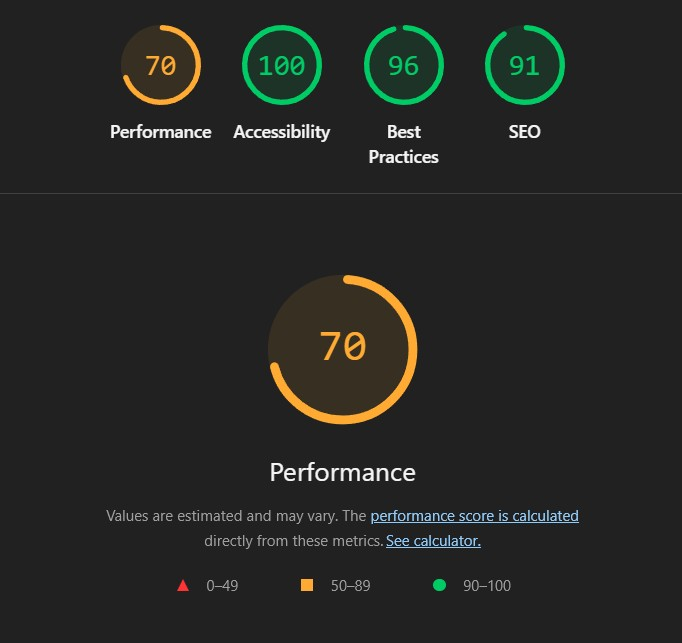

##### 4.2.9.1.2 About page

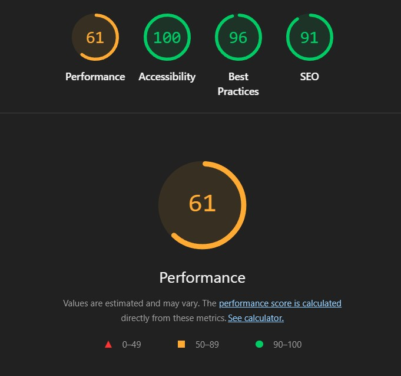

##### 4.2.9.1.3 Events - Upcoming gigs page

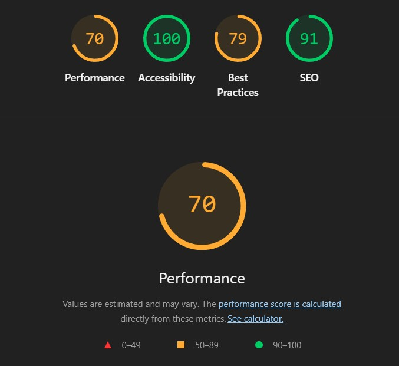

##### 4.2.9.1.4 Events - Previous gigs page

##### 4.2.9.1.5 Merch - List page

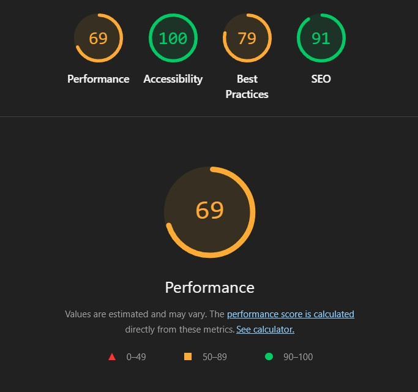

##### 4.2.9.1.6 Merch - Detail page

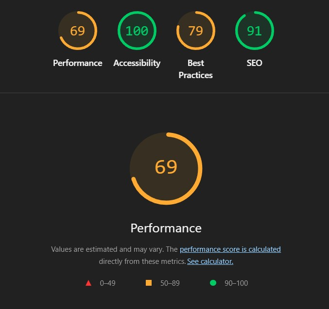

##### 4.2.9.1.7 Roxoff page

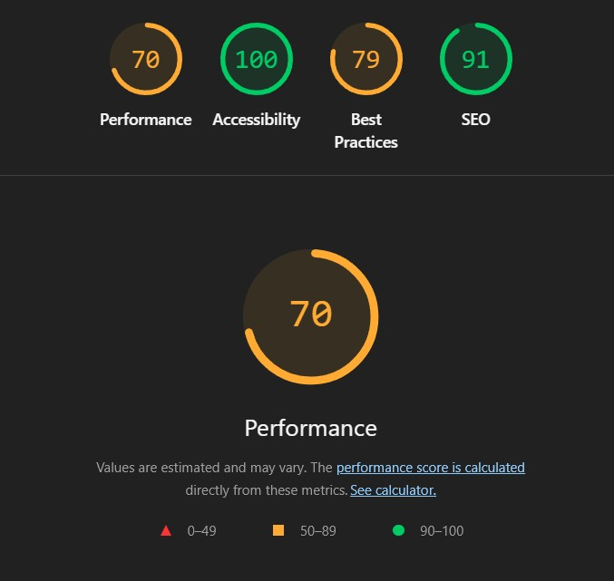

##### 4.2.9.1.8 Search - Artists page

This page was tested using the letter 'a'.

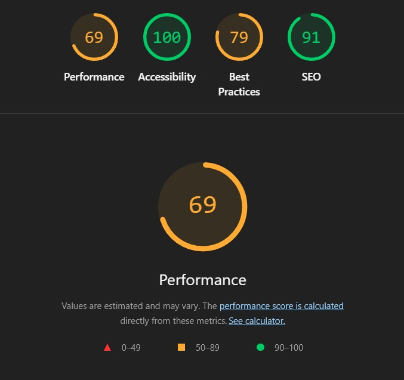

##### 4.2.9.1.9 Search - Venue page

This page was tested using the letter 'e'.

##### 4.2.9.1.10 Search - Merch page

This page was tested using the word 'hoodie'.

##### 4.2.9.1.11 Contact page

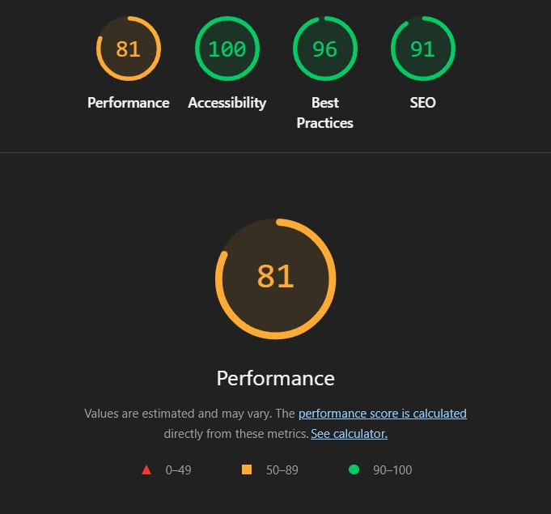

##### 4.2.9.1.12 Account - Signup page

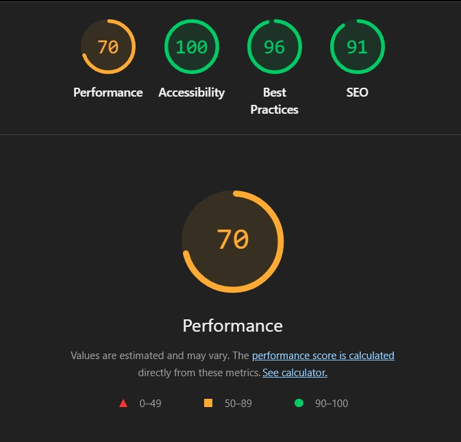

##### 4.2.9.1.13 Account - Login page

##### 4.2.9.1.14 Account - Password reset page

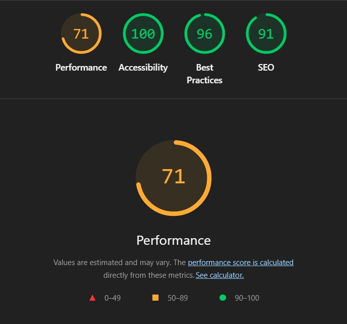

##### 4.2.9.1.15 Account - Logout page

**What Was Tested:**  
*Lighthouse* testing was attempted on the logout page to verify accessibility, performance, and best practice metrics.  

**Acceptance Criteria:**  
- [x] Logout page loads successfully for authenticated users.  
- [x] User session is securely ended.  
- [x] `logged_out.html` template renders correctly.  
- [ ] *Lighthouse* analysis completes successfully (cannot be tested).  

**Tasks Completed:**  
- [x] Verified logout page manually in the browser.  
- [x] Confirmed correct use of `POST` method for `CSRF` protection.  
- [x] Confirmed logout template renders and user session ends.  

**Notes:**  
*Lighthouse* testing cannot be performed on this page because *Django*’s `LogoutView` requires a valid `CSRF` token and an active session to process `POST` requests. *Lighthouse* operates in an unauthenticated sandbox environment, which prevents it from submitting secure `POST` requests, resulting in a *405 Method Not Allowed* response. Manual testing confirmed that the logout page functions securely and correctly for real users.

##### 4.2.9.1.16 Account - Orders page

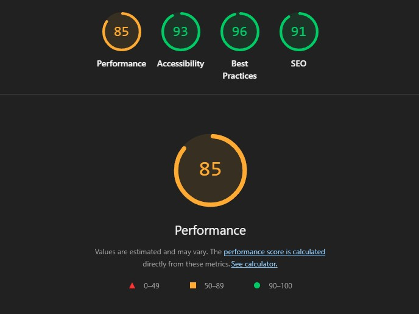

##### 4.2.9.1.17 View Basket page

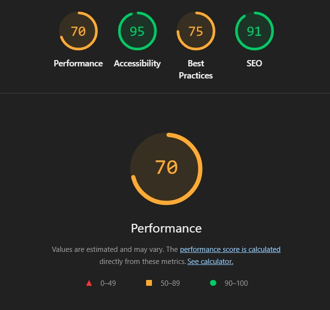

##### 4.2.9.1.18 Order Summary page

##### 4.2.9.1.19 Payment Summary page

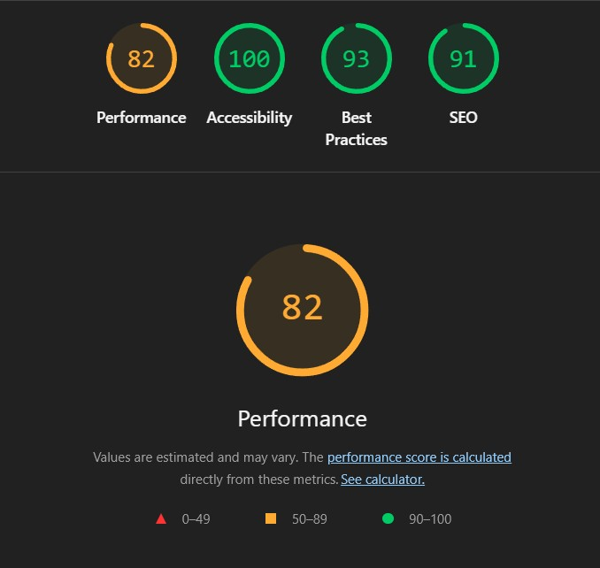

##### 4.2.9.1.20 Order Confirmation page

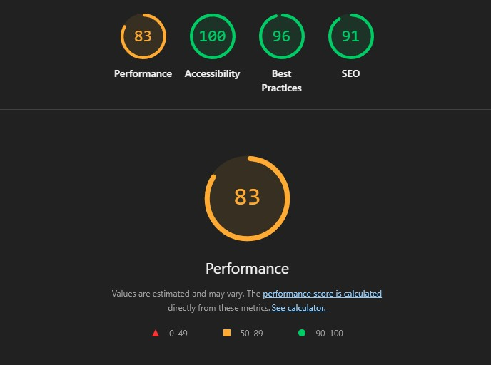

##### 4.2.9.1.20 404 page

For testing the 404 page I used the following url: https://slp-upgrade-910f8354c673.herokuapp.com/404test/

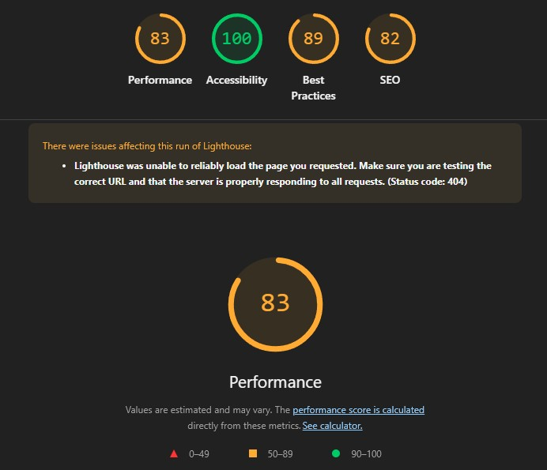

##### 4.2.9.1.20 500 page

For testing the 500 page I used the following url: https://slp-upgrade-910f8354c673.herokuapp.com/crash/

---

#### 4.2.9.2 CSS Validation

*CSS* validation was completed using *W3C* CSS Validator and both style sheets passed first time, and without errors or warnings.

##### 4.2.9.2.1 style.css

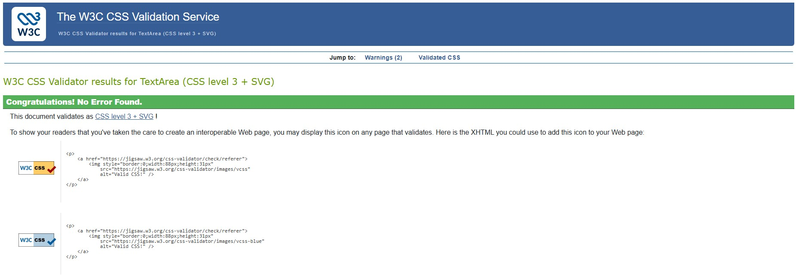

##### 4.2.9.2.2 square-checkout.css

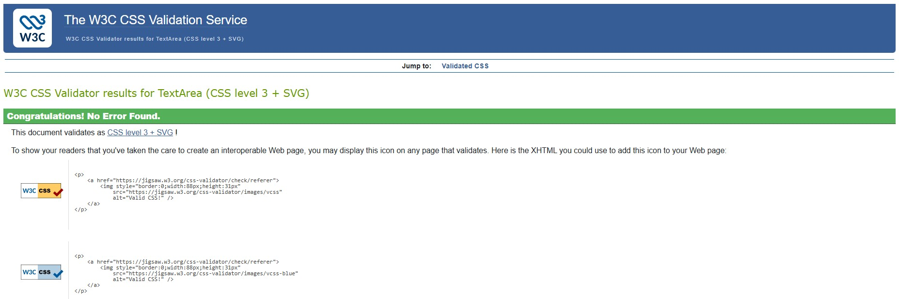

---

#### 4.2.9.3 HTLML Validation

Below are the results for each of the HTML templates within the project and their corrresponding results using W3C Markup Validator.

##### 4.2.9.3.1 Base Template

These validation errors appear because the *Django* template engine tag `` is placed before the `<!DOCTYPE html>` declaration in the base template. The *HTML validator* reads this tag as plain text, not as a *Django* instruction, and therefore reports that the document is missing a `doctype` and that subsequent tags like `<html>` and `<head>` are “stray.” These errors only occur in the unrendered *Django* template and do not appear in the final rendered *HTML* served to users, where the `` tag is processed and removed. The rendered output of the live site begins correctly with `<!DOCTYPE html>` and is fully valid *HTML*.

##### 4.2.9.3.2 Home template

##### 4.2.9.3.3 About template  

##### 4.2.9.3.4 Events - Upcoming gigs template  

##### 4.2.9.3.5 Events - Previous gigs template  

##### 4.2.9.3.6 Merch - List template  

##### 4.2.9.3.7 Merch - Detail template  

##### 4.2.9.3.8 Roxoff template  

##### 4.2.9.3.9 Search - Artists template  

This template was tested using the letter 'a'.  

##### 4.2.9.3.10 Search - Venue template  

This template was tested using the letter 'e'.  

##### 4.2.9.3.11 Search - Merch template  

This template was tested using the word 'hoodie'.  

##### 4.2.9.3.12 Contact template  

##### 4.2.9.3.13 Account - Signup template  

##### 4.2.9.3.14 Account - Login template  

##### 4.2.9.3.15 Account - Password reset template  

##### 4.2.9.3.16 Account - Logout template  

**What Was Tested:**  
*Lighthouse* testing was attempted on the logout template to verify accessibility, performance, and best practice metrics.  

**Acceptance Criteria:**  
- [x] Logout template loads successfully for authenticated *users*.  
- [x] User session is securely ended.  
- [x] `logged_out.html` template renders correctly.  
- [ ] *Lighthouse* analysis completes successfully (cannot be tested).  

**Tasks Completed:**  
- [x] Verified logout template manually in the browser.  
- [x] Confirmed correct use of `POST` method for `CSRF` protection.  
- [x] Confirmed logout template renders and user session ends.  

**Notes:**  
*Lighthouse* testing cannot be performed on this template because *Django*’s `LogoutView` requires a valid `CSRF` token and an active session to process `POST` requests. *Lighthouse* operates in an unauthenticated sandbox environment, which prevents it from submitting secure `POST` requests, resulting in a *405 Method Not Allowed* response. Manual testing confirmed that the logout template functions securely and correctly for real *users*.  

##### 4.2.9.3.17 Account - Orders template  

##### 4.2.9.3.18 View Basket template  

##### 4.2.9.3.19 Order Summary template  

##### 4.2.9.3.20 Payment Summary template  

##### 4.2.9.3.21 Order Confirmation template  

##### 4.2.9.3.22 404 template  

For testing the 404 template I used the following URL:  
https://slp-upgrade-910f8354c673.herokuapp.com/404test/  

##### 4.2.9.3.23 500 template  

For testing the 500 template I used the following URL:  
https://slp-upgrade-910f8354c673.herokuapp.com/crash/  

#### 4.2.4 JSHint

##### 4.2.4.1 script.js

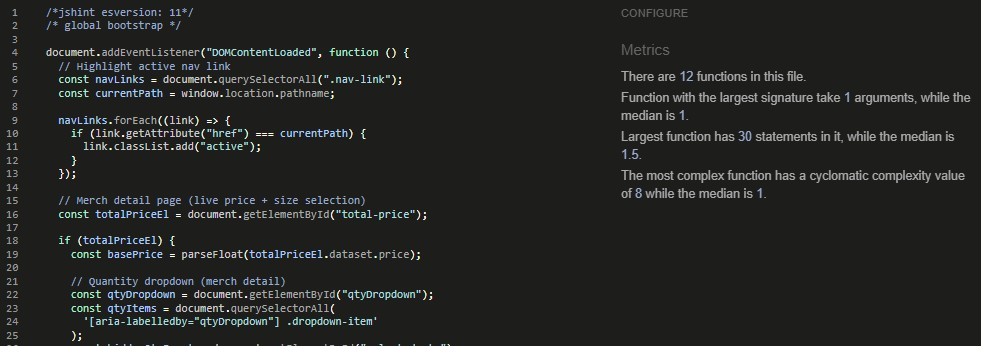

##### 4.2.4.2 square-checkout.js

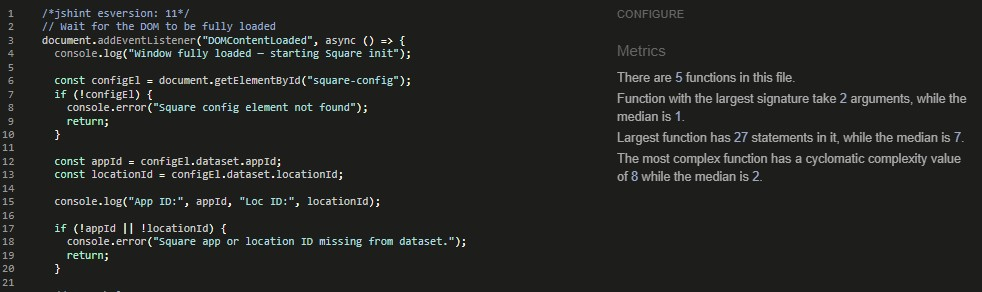

---

#### 4.2.10 Responsive Testing

The video below shows a walk through of the resposive design from 320px to 1440px (max-width). This was captured using a *Loom*.

<a href="https://www.loom.com/share/7540ce4a105a416abedbfc50a50cc7ad?sid=07516197-1b03-4d04-b4c4-61d1ac71324a" target="_blank">Watch responsive video</a>

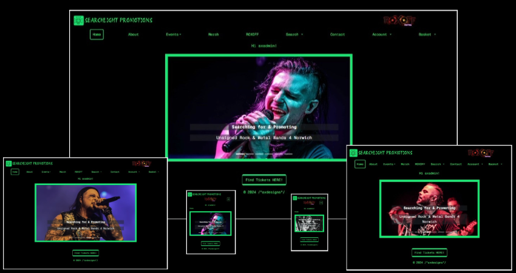

